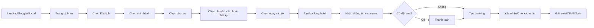
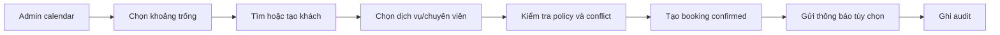
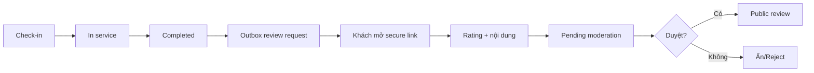
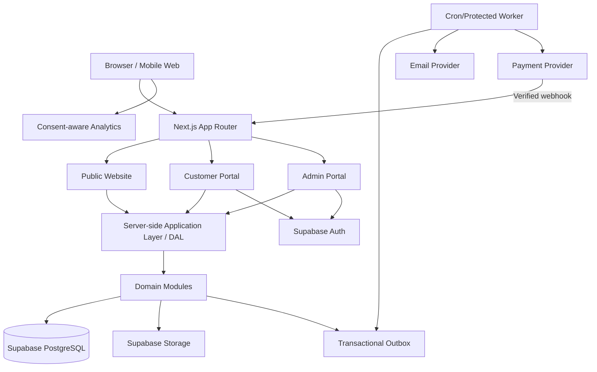
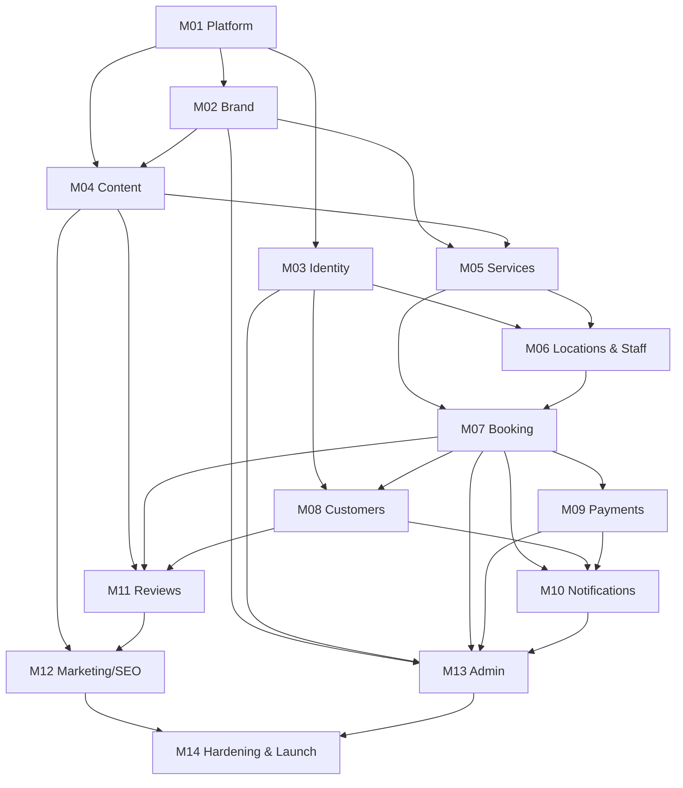
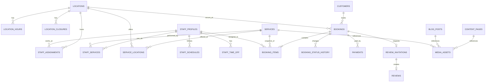

# HATO BEAUTY — KIẾN TRÚC WEBSITE DỊCH VỤ LÀM ĐẸP & HỆ THỐNG ĐẶT LỊCH

**Tên file chuẩn:** `HATO_BEAUTY_WEBSITE_ARCHITECTURE.md`  
**Thương hiệu:** Hato Beauty  
**Phiên bản tài liệu:** 1.0 — Implementation Baseline  
**Ngày:** 27/07/2026  
**Trạng thái:** Source of truth đề xuất để triển khai  
**Đối tượng đọc:** Product Owner, Designer, Technical Lead, Developer, QA, DevOps và AI coding agent như GPT-5.6 Terra/Codex  
**Kiến trúc chủ đạo:** Modular Monolith trên Next.js App Router + Supabase PostgreSQL/Auth/Storage  
**Ngôn ngữ giao diện MVP:** Tiếng Việt  
**Tiền tệ:** VND  
**Múi giờ mặc định:** `Asia/Ho_Chi_Minh`

> Tài liệu này được thiết kế để có thể đặt tại thư mục gốc của repository và giao trực tiếp cho GPT-5.6 Terra triển khai theo từng module. Đây là tài liệu nguồn duy nhất ở cấp kiến trúc. Khi code, mọi thay đổi ảnh hưởng module boundary, dữ liệu, permission, booking semantics, payment provider hoặc workflow phải được ghi bằng Architecture Decision Record trong `docs/adr/`.

> **Lưu ý về logo:** Trong môi trường tạo tài liệu này, file logo đính kèm chưa truy xuất được thành asset để đo màu chính xác. Vì vậy bảng màu kem–be trong tài liệu là baseline tạm thời. Khi logo chính thức được đặt vào repository, Module M02 bắt buộc thực hiện Brand Approval Gate, lấy màu trực tiếp từ logo và cập nhật token trước khi khóa visual baseline. Không được tự vẽ lại hoặc làm biến dạng logo.

---

## 0. QUY ƯỚC VÀ CÁCH SỬ DỤNG

### 0.1. Mức độ bắt buộc

- **MUST / PHẢI:** yêu cầu bắt buộc; chỉ thay đổi bằng ADR được duyệt.
- **MUST NOT / KHÔNG ĐƯỢC:** hành vi bị cấm trong baseline hiện tại.
- **SHOULD / NÊN:** mặc định phải làm; nếu bỏ phải ghi lý do trong PR hoặc ADR.
- **MAY / CÓ THỂ:** tùy chọn, không phải điều kiện hoàn thành MVP.

### 0.2. Cách giao cho GPT-5.6 Terra

1. Đặt file này tại root repository.
2. Tạo thêm `AGENTS.md` bằng nội dung ở Phụ lục A hoặc yêu cầu agent sinh từ Section 27.
3. Cung cấp logo thật tại `public/brand/hato-beauty-logo.*` và các ảnh thương hiệu được phép sử dụng.
4. Yêu cầu agent triển khai đúng thứ tự dependency ở Section 11 và Work Breakdown ở Section 21.
5. Không giao toàn bộ hệ thống trong một PR. Mỗi module phải chia thành các vertical slice nhỏ, có migration, test và handoff evidence.
6. Chỉ xem một module hoàn thành khi lint, typecheck, test, build, security checks và acceptance flow tương ứng đều đạt.

### 0.3. Nguyên tắc khi thiếu thông tin

- Agent không dừng vì thiếu nội dung không trọng yếu.
- Agent ghi giả định vào `docs/ASSUMPTIONS.md`, dùng dữ liệu mẫu và tiếp tục.
- Agent chỉ hỏi khi gặp hard blocker: thiếu credential bắt buộc để kiểm thử tích hợp thật, yêu cầu mâu thuẫn nghiêm trọng, thiếu logo/asset để chốt brand production, hoặc hành động có nguy cơ làm mất dữ liệu thật.
- Không tự chọn thêm framework, state manager, payment provider, CMS hoặc hệ thống queue nếu chưa có trong baseline hay ADR.

---

## 1. EXECUTIVE SUMMARY

### 1.1. Mục tiêu sản phẩm

Xây dựng website chính thức cho **Hato Beauty** với hình ảnh thanh lịch, ấm áp, tinh tế theo tông kem–be; đồng thời số hóa hành trình từ khám phá dịch vụ đến đặt lịch, chăm sóc sau dịch vụ và quản trị vận hành.

Hệ thống phải giải quyết bốn bài toán chính:

1. **Thương hiệu và chuyển đổi:** giới thiệu Hato Beauty, dịch vụ, chuyên viên, chi nhánh, bảng giá, ưu đãi và nội dung chuyên môn rõ ràng.
2. **Đặt lịch:** khách chọn dịch vụ, địa điểm, chuyên viên hoặc “bất kỳ chuyên viên phù hợp”, ngày giờ và nhận xác nhận mà không bị trùng lịch.
3. **Vận hành:** lễ tân/quản lý xem lịch theo ngày, xác nhận, đổi lịch, hủy, check-in, hoàn thành và theo dõi trạng thái.
4. **Marketing và dữ liệu:** SEO địa phương, nguồn chiến dịch, review, nội dung blog, báo cáo booking và tỷ lệ chuyển đổi.

### 1.2. Quyết định kiến trúc chính

- Dùng **modular monolith** thay vì microservices để giảm chi phí vận hành, giữ transaction đặt lịch nhất quán và phù hợp đội nhỏ.
- Dùng **Next.js App Router** cho website public, customer portal và admin trong cùng repository.
- Dùng **Supabase PostgreSQL** làm source of truth; Supabase Auth cho tài khoản; Supabase Storage cho media.
- Mọi business mutation đi qua server-side command hoặc Route Handler đã authorize; UI không ghi trực tiếp database.
- Booking conflict được bảo vệ ở cả application layer và PostgreSQL exclusion constraint.
- Public website ưu tiên server rendering, metadata, structured data và tải JavaScript tối thiểu.
- Tích hợp thanh toán, email, SMS/Zalo được đóng gói qua provider adapter, không để SDK rải rác trong domain.
- Hỗ trợ nhiều chi nhánh từ data model ngày đầu, nhưng không xây multi-tenant SaaS.

### 1.3. Kết quả MVP mong đợi

- Website responsive hoàn chỉnh cho mobile, tablet và desktop.
- Trang dịch vụ và chi nhánh có SEO, metadata, sitemap và JSON-LD phù hợp.
- Quy trình đặt lịch khách vãng lai hoạt động end-to-end.
- Không có double-booking cho cùng chuyên viên và khung giờ.
- Admin có lịch ngày/tuần, danh sách booking, khách hàng cơ bản, dịch vụ, nhân sự và nội dung.
- Email xác nhận và nhắc lịch có outbox/retry.
- Có staging, CI, migration, backup plan, logs và test tự động.

---

## 2. GIẢ ĐỊNH NỀN VÀ CÁC QUYẾT ĐỊNH CẦN XÁC NHẬN

### 2.1. Giả định mặc định để agent có thể triển khai ngay

| Chủ đề | Baseline mặc định |
|---|---|
| Mô hình kinh doanh | Một thương hiệu Hato Beauty, có thể có nhiều chi nhánh |
| Địa bàn | Việt Nam |
| Ngôn ngữ | Tiếng Việt; chưa triển khai đa ngôn ngữ trong MVP |
| Tiền tệ | VND, hiển thị không có phần thập phân |
| Múi giờ | `Asia/Ho_Chi_Minh`; lưu thời gian trong DB bằng UTC |
| Loại dịch vụ | Dịch vụ làm đẹp không yêu cầu quản lý hồ sơ y tế trong MVP |
| Đặt lịch | Cho phép khách vãng lai đặt lịch; tài khoản khách là tùy chọn |
| Thanh toán | Thanh toán tại cơ sở là mặc định; đặt cọc online là feature flag |
| Quy mô ban đầu | 1–5 chi nhánh, 2–50 chuyên viên, vài nghìn booking/tháng |
| Lịch hẹn | MVP hỗ trợ một dịch vụ chính trên một booking; schema cho phép mở rộng nhiều booking item |
| Xác nhận | Có thể tự động xác nhận hoặc yêu cầu lễ tân xác nhận theo cấu hình dịch vụ/chi nhánh |
| Kênh thông báo | Email là kênh production đầu tiên; SMS/Zalo thêm qua adapter |
| Ảnh | Chỉ dùng ảnh có quyền sử dụng và consent phù hợp |
| Nội dung nhạy cảm | Không lưu hồ sơ bệnh án, chẩn đoán, đơn thuốc hoặc ảnh khách riêng tư trong MVP |

### 2.2. Các quyết định Product Owner cần chốt trước production

- Danh sách dịch vụ, nhóm dịch vụ, giá, thời lượng, buffer trước/sau.
- Chi nhánh, địa chỉ, tọa độ, số điện thoại, giờ mở cửa, ngày nghỉ.
- Danh sách chuyên viên, dịch vụ có thể thực hiện, lịch làm việc.
- Chính sách đặt lịch, đổi lịch, hủy, no-show và đặt cọc.
- Booking tự động xác nhận hay cần duyệt.
- Kênh thông báo production: email, SMS, Zalo OA hoặc kết hợp.
- Payment provider nếu bật đặt cọc.
- Domain chính thức, email gửi, social profiles và tài khoản Google Business Profile.
- Nội dung chính sách riêng tư, điều khoản, cookie và consent do đơn vị pháp lý duyệt.
- Logo vector, font có bản quyền, hình ảnh hero, dịch vụ, chi nhánh, chuyên viên.
- GA4/GTM, Meta Pixel và quy tắc consent marketing.

Các điểm trên không chặn việc dựng hệ thống bằng seed data; chúng chỉ chặn việc khóa production content và go-live.

---

## 3. GOALS, NON-GOALS VÀ CHỈ SỐ THÀNH CÔNG

### 3.1. Product goals

- Người dùng tìm được dịch vụ phù hợp trong tối đa ba bước điều hướng.
- CTA “Đặt lịch” luôn rõ trên mobile và desktop nhưng không gây cảm giác bán hàng gấp gáp.
- Khách hoàn tất booking trong một flow đơn giản, có trạng thái và thông báo rõ ràng.
- Lễ tân quản lý lịch trong một màn hình chính, giảm thao tác thủ công qua điện thoại/chat.
- Nội dung và media có thể cập nhật mà không cần sửa source code cho các trường phổ biến.
- Hệ thống giữ được lịch sử booking và audit quan trọng.

### 3.2. Engineering goals

- Module cohesion cao, coupling thấp; mỗi table có owner rõ.
- Không có business rule trong React component, middleware hoặc generic utility.
- Không có SDK provider rải rác trong codebase.
- Tất cả input public được validate và rate-limit.
- Mọi mutation quan trọng idempotent hoặc có idempotency key.
- Booking overlap được chặn ở database, không chỉ dựa vào UI.
- RLS/authorization có positive và negative tests.
- Production có rollback, backup, audit và failure observability.

### 3.3. Non-goals MVP

- Không xây hệ thống POS, kho, kế toán, payroll hoặc commission đầy đủ.
- Không xây loyalty phức tạp, ví điểm, membership tier hoặc gift card trong MVP.
- Không xây marketplace cho nhiều thương hiệu.
- Không xây ứng dụng native iOS/Android.
- Không xây hồ sơ y tế, tư vấn chẩn đoán hoặc telemedicine.
- Không xây AI tư vấn thay chuyên gia.
- Không xây page builder tự do kiểu kéo-thả.
- Không thêm microservices, Kafka, Kubernetes hoặc event bus ngoài nhu cầu thực tế.
- Không hỗ trợ nhiều ngôn ngữ cho đến khi có content và yêu cầu rõ.

### 3.4. KPI đề xuất sau go-live

| Nhóm | Chỉ số | Mục tiêu ban đầu |
|---|---|---|
| Chuyển đổi | Tỷ lệ bắt đầu booking → hoàn tất booking | Theo dõi baseline 30 ngày đầu, sau đó tối ưu |
| Vận hành | Booking trùng lịch do hệ thống | 0 |
| Trải nghiệm | Tỷ lệ lỗi ở booking flow | < 1% request hợp lệ |
| Tốc độ | LCP p75 public pages | ≤ 2,5 giây |
| Tương tác | INP p75 | < 200 ms |
| Ổn định hình ảnh | CLS p75 | < 0,1 |
| Thông báo | Email booking gửi thành công | ≥ 99% sau retry, không tính provider outage |
| SEO | Trang dịch vụ/chi nhánh hợp lệ trong sitemap và indexable | 100% trang published |
| Chất lượng | Critical/High security issue mở tại go-live | 0 |
| Khả dụng | Booking core có monitoring và cảnh báo | Có |

Các số hiệu năng là engineering target, không phải SLA pháp lý.

---

## 4. PERSONAS, VAI TRÒ VÀ PHÂN QUYỀN

### 4.1. Personas

#### Khách vãng lai

- Xem dịch vụ, giá, chuyên viên, chi nhánh, ưu đãi, bài viết.
- Kiểm tra khung giờ và đặt lịch không cần tạo tài khoản.
- Gửi liên hệ và đăng ký nhận tin khi đã consent.

#### Khách hàng có tài khoản

- Xem lịch sắp tới và lịch sử.
- Đổi/hủy theo chính sách.
- Cập nhật thông tin liên hệ và preference marketing.
- Gửi review sau booking hoàn thành.

#### Lễ tân

- Xem lịch theo ngày/tuần/chi nhánh.
- Tạo booking thay khách, xác nhận, đổi, hủy, check-in, đánh dấu no-show.
- Xem thông tin liên hệ cần thiết của khách.

#### Chuyên viên

- Xem lịch cá nhân và thông tin booking tối thiểu cần phục vụ.
- Đánh dấu bắt đầu/hoàn thành nếu được cấp quyền.
- Không xem dashboard tài chính hoặc dữ liệu khách ngoài lịch của mình.

#### Quản lý chi nhánh

- Quản lý lịch, nhân sự, giờ làm, ngày nghỉ và báo cáo chi nhánh.
- Quản lý dịch vụ khả dụng tại chi nhánh trong phạm vi được cấp.

#### Biên tập nội dung / Marketing

- Quản lý trang, blog, ưu đãi, media, SEO metadata, review công khai.
- Xem analytics tổng hợp; không xem dữ liệu cá nhân không cần thiết.

#### Super Admin

- Quản lý toàn bộ, role, settings, provider config reference và audit.
- Không được xem secret raw trong UI.

### 4.2. Capability model

Không kiểm tra quyền bằng raw string rải rác như `if (role === 'admin')`. Phải định nghĩa capability constants và resolver trung tâm.

Ví dụ capability:

```ts
export const permissions = {
  bookingReadOwn: 'booking.read.own',
  bookingReadLocation: 'booking.read.location',
  bookingCreateForCustomer: 'booking.create.for_customer',
  bookingConfirm: 'booking.confirm',
  bookingReschedule: 'booking.reschedule',
  bookingCancel: 'booking.cancel',
  bookingCheckIn: 'booking.check_in',
  bookingComplete: 'booking.complete',
  scheduleManageOwn: 'schedule.manage.own',
  scheduleManageLocation: 'schedule.manage.location',
  serviceManage: 'service.manage',
  contentManage: 'content.manage',
  reviewModerate: 'review.moderate',
  reportReadLocation: 'report.read.location',
  reportReadAll: 'report.read.all',
  roleManage: 'role.manage',
  settingsManage: 'settings.manage',
  auditRead: 'audit.read',
} as const;
```

### 4.3. Ma trận quyền rút gọn

| Hành động | Guest | Customer | Specialist | Receptionist | Location Manager | Marketing | Super Admin |
|---|---:|---:|---:|---:|---:|---:|---:|
| Xem nội dung published | ✓ | ✓ | ✓ | ✓ | ✓ | ✓ | ✓ |
| Tạo booking cho bản thân | ✓ | ✓ | ✓ | ✓ | ✓ | ✓ | ✓ |
| Xem booking của mình | Qua secure lookup | ✓ | Chỉ lịch được gán | Theo chi nhánh | Theo chi nhánh | Không | ✓ |
| Tạo booking thay khách | — | — | Tùy chọn | ✓ | ✓ | — | ✓ |
| Xác nhận/đổi/hủy booking | Theo policy + token | Theo policy | Hạn chế | ✓ | ✓ | — | ✓ |
| Quản lý lịch làm việc | — | — | Own nếu bật | — | Location | — | ✓ |
| Quản lý dịch vụ | — | — | — | — | Hạn chế | ✓ nếu cấp | ✓ |
| Quản lý content/SEO | — | — | — | — | — | ✓ | ✓ |
| Xem báo cáo doanh thu | — | Own receipt | — | Hạn chế | Location | Aggregate | ✓ |
| Quản lý role/settings | — | — | — | — | — | — | ✓ |

### 4.4. Nguyên tắc dữ liệu tối thiểu

- Specialist chỉ nhận tên khách, dịch vụ, thời gian, ghi chú phục vụ đã được phép; không nhận full marketing profile.
- Marketing chỉ nhận số liệu aggregate; không export phone/email trừ chiến dịch có consent và quyền rõ.
- Public booking lookup phải dùng token ngẫu nhiên, có hết hạn hoặc yêu cầu xác minh email/phone; không truy vấn bằng booking code dễ đoán đơn lẻ.
- Service-role key chỉ dùng server-side cho tác vụ đã review, tuyệt đối không xuất hiện trong client bundle.

---

## 5. PHẠM VI THEO GIAI ĐOẠN

### 5.1. MVP / Phase 1 — Website + Booking Core

- Home, giới thiệu, dịch vụ, chi tiết dịch vụ, chuyên viên, chi nhánh, liên hệ, FAQ, chính sách.
- Danh mục dịch vụ, giá từ, thời lượng, mô tả, ảnh, lợi ích, lưu ý.
- Quản lý chi nhánh, giờ mở cửa, ngày nghỉ.
- Quản lý chuyên viên, dịch vụ có thể thực hiện, lịch làm việc và time-off.
- Kiểm tra slot khả dụng.
- Guest booking một dịch vụ, chọn chuyên viên hoặc “bất kỳ”.
- Booking hold, xác nhận, đổi/hủy theo policy.
- Admin booking calendar/list.
- Email xác nhận, đổi/hủy, nhắc lịch.
- Basic customer record, contact form, review moderation cơ bản.
- Blog/nội dung SEO cơ bản.
- GA4/GTM/Meta Pixel theo consent và feature flag.
- CI/CD, test, monitoring, backup/restore runbook.

### 5.2. Phase 2 — Tăng chuyển đổi và tự phục vụ

- Customer account, magic link/OTP, booking history.
- Online deposit/payment provider.
- Package/combo, add-on, voucher/promotion rule.
- SMS hoặc Zalo OA notification adapter.
- Waitlist khi hết slot.
- Review request automation.
- Staff portal nâng cao.
- CSV export và báo cáo doanh thu/no-show/source.
- Calendar sync hoặc ICS.

### 5.3. Phase 3 — Tăng trưởng

- Loyalty/membership.
- Gift card.
- Referral.
- Multi-service booking UI.
- Tối ưu lịch theo room/equipment resource.
- CRM/POS integration.
- Marketing automation nâng cao.
- Đa ngôn ngữ.
- PWA nếu dữ liệu sử dụng chứng minh nhu cầu.

---

## 6. BRAND, UX/UI VÀ DESIGN SYSTEM

### 6.1. Tinh thần thương hiệu Hato Beauty

- Thanh lịch, ấm áp, tinh tế, sạch sẽ và đáng tin cậy.
- Cảm giác chăm sóc cá nhân, thư thái, không lạnh lẽo như phần mềm doanh nghiệp.
- Hình ảnh cao cấp vừa phải; không phô trương, không “sale sốc”.
- Nội dung rõ, dịu, tôn trọng cơ thể và sự khác biệt của khách hàng.

### 6.2. Những điều không được làm

- Không dùng gradient mạnh, neon, glassmorphism dày hoặc hiệu ứng quá nhiều.
- Không kéo giãn, đổi tỷ lệ, đổi màu tùy tiện hoặc redraw logo.
- Không dùng ảnh AI/stock làm người xem hiểu nhầm là kết quả dịch vụ thật.
- Không retouch da quá mức, không dùng before/after thiếu consent hoặc disclaimer.
- Không dùng copy gây áp lực, body shaming, hứa hẹn y khoa hoặc kết quả tuyệt đối.
- Không hard-code màu trong feature component.
- Không tự thêm dark mode trong MVP.

### 6.3. Brand Approval Gate

Trước khi code UI production, Module M02 phải:

1. Đặt logo gốc vào `public/brand/source/`.
2. Ghi nguồn, định dạng, kích thước, vùng an toàn và phiên bản asset.
3. Trích màu logo bằng công cụ đo màu, không đo bằng mắt.
4. Kiểm tra contrast khi dùng màu logo trên nền kem/trắng.
5. Chốt font display và font body có hỗ trợ tiếng Việt.
6. Tạo `docs/brand/BRAND_SPEC.md` và `public/brand/manifest.json`.
7. Tạo trang `/dev/design-system` chỉ bật local/staging.
8. Chụp visual baseline ở mobile 390px, tablet 768px và desktop 1440px.
9. Brand Owner duyệt trước khi khóa token.

### 6.4. Token màu baseline tạm thời

```css
:root {
  --hb-bg: #fbf7f0;
  --hb-surface: #fffdf9;
  --hb-surface-muted: #f2e8dc;
  --hb-surface-strong: #e8d9c7;
  --hb-border: #ddcdbc;

  --hb-text: #2d2824;
  --hb-text-muted: #6f655d;
  --hb-text-inverse: #fffdf9;

  --hb-primary: #6b4f3f;
  --hb-primary-hover: #563e31;
  --hb-primary-soft: #eadfd4;
  --hb-accent: #b78962;

  --hb-success: #2f6b50;
  --hb-warning: #8a5a1f;
  --hb-danger: #9b3f3f;
  --hb-focus: #7b5b49;
}
```

Các giá trị trên chỉ là fallback. Sau Brand Approval Gate, token production phải phản ánh logo thật và đạt contrast yêu cầu.

### 6.5. Typography baseline

- Heading/display: `Lora` hoặc font serif tương đương có hỗ trợ tiếng Việt, được load qua `next/font`.
- Body/UI: `Be Vietnam Pro` hoặc font sans phù hợp logo, được self-host qua `next/font`.
- Không dùng quá hai family font.
- Body mặc định 16px, line-height 1.6.
- Form control không nhỏ hơn 16px trên mobile để tránh zoom không mong muốn.

### 6.6. Spacing, radius và motion

- Grid spacing theo bội số 4px; section thường 64–112px desktop, 40–72px mobile.
- Radius vừa phải: 10–18px; không biến toàn bộ UI thành pill.
- Shadow mềm, ít lớp, không thay border bằng shadow trong admin tables.
- Motion 150–250ms; hỗ trợ `prefers-reduced-motion`.
- Touch target tối thiểu 44×44px.

### 6.7. Component inventory

#### Primitive

- `Button`, `IconButton`, `LinkButton`
- `Input`, `Textarea`, `Select`, `Checkbox`, `RadioGroup`, `Switch`
- `Label`, `FieldError`, `HelperText`
- `Card`, `Badge`, `Separator`, `Tabs`, `Accordion`
- `Dialog`, `Drawer`, `Popover`, `Tooltip`, `Toast`
- `Skeleton`, `Spinner`, `EmptyState`, `ErrorState`
- `Container`, `Section`, `Stack`, `Cluster`, `Grid`

#### Brand/public

- `HatoLogo`
- `PublicHeader`, `MobileNav`, `PublicFooter`
- `Hero`, `SectionHeading`, `EditorialQuote`
- `ServiceCard`, `ServicePrice`, `ServiceBenefitList`
- `StaffCard`, `LocationCard`, `ReviewCard`
- `OfferBanner`, `ArticleCard`, `FAQList`
- `BookingCTA`, `FloatingBookingButton`
- `ImageWithFocalPoint`, `ConsentAwareBeforeAfter`

#### Booking

- `BookingStepper`
- `LocationPicker`
- `ServicePicker`
- `StaffPreferencePicker`
- `DatePicker`
- `TimeSlotGrid`
- `BookingSummary`
- `CustomerContactForm`
- `PolicyConsent`
- `PaymentStep`
- `BookingSuccess`

#### Admin

- `AdminShell`, `AdminSidebar`, `CommandBar`
- `DataTable`, `FilterBar`, `Pagination`
- `CalendarDayView`, `CalendarWeekView`
- `BookingDrawer`, `StatusBadge`, `Timeline`
- `MetricCard`, `ExportButton`, `AuditPanel`

### 6.8. Tone of voice

| Tình huống | Copy khuyến nghị |
|---|---|
| CTA chính | “Đặt lịch chăm sóc” hoặc “Chọn thời gian phù hợp” |
| Chưa có slot | “Khung giờ này vừa được chọn. Hãy chọn thời gian khác nhé.” |
| Giữ chỗ | “Hato Beauty đang giữ khung giờ này cho bạn trong 10 phút.” |
| Booking thành công | “Lịch của bạn đã được ghi nhận.” |
| Chờ xác nhận | “Hato Beauty sẽ xác nhận lịch sớm qua thông tin bạn đã cung cấp.” |
| Hủy thành công | “Lịch đã được hủy. Cảm ơn bạn đã báo trước.” |
| Lỗi hệ thống | “Chưa thể hoàn tất lúc này. Thông tin bạn nhập vẫn được giữ; vui lòng thử lại.” |
| Không có dữ liệu | “Chưa có lịch nào trong khoảng thời gian này.” |

---

## 7. INFORMATION ARCHITECTURE VÀ ROUTE MAP

### 7.1. Public routes

```text
/
/gioi-thieu
/dich-vu
/dich-vu/[service-slug]
/chuyen-vien
/chuyen-vien/[staff-slug]
/chi-nhanh
/chi-nhanh/[location-slug]
/uu-dai
/uu-dai/[promotion-slug]
/cam-nang
/cam-nang/[post-slug]
/cau-hoi-thuong-gap
/lien-he
/dat-lich
/dat-lich/thanh-cong
/tra-cuu-lich
/chinh-sach/rieng-tu
/chinh-sach/dat-lich-va-huy
/chinh-sach/thanh-toan
/dieu-khoan-su-dung
```

### 7.2. Customer routes

```text
/tai-khoan/dang-nhap
/tai-khoan/xac-thuc
/tai-khoan
/tai-khoan/lich-hen
/tai-khoan/lich-hen/[booking-code]
/tai-khoan/ho-so
/tai-khoan/tuy-chon-lien-lac
```

Customer account có thể tắt bằng feature flag trong MVP; guest booking vẫn hoạt động.

### 7.3. Admin routes

```text
/admin/dang-nhap
/admin
/admin/lich-hen
/admin/lich-hen/[booking-id]
/admin/lich
/admin/khach-hang
/admin/khach-hang/[customer-id]
/admin/dich-vu
/admin/dich-vu/[service-id]
/admin/nhom-dich-vu
/admin/chuyen-vien
/admin/chuyen-vien/[staff-id]
/admin/chi-nhanh
/admin/chi-nhanh/[location-id]
/admin/lich-lam-viec
/admin/ngay-nghi
/admin/noi-dung/trang
/admin/noi-dung/bai-viet
/admin/noi-dung/uu-dai
/admin/noi-dung/media
/admin/danh-gia
/admin/thong-bao
/admin/bao-cao
/admin/cai-dat
/admin/nguoi-dung-va-quyen
/admin/audit
```

### 7.4. Navigation public

Desktop primary nav:

```text
Dịch vụ | Chuyên viên | Chi nhánh | Cẩm nang | Về Hato | [Đặt lịch]
```

Mobile:

- Header gọn với logo, menu và CTA đặt lịch.
- Có thể dùng bottom sticky CTA ở trang dịch vụ/chi nhánh.
- Không dùng hai CTA cạnh tranh trong cùng viewport.

### 7.5. Nội dung trang chủ

1. Hero: value proposition + CTA + ảnh thương hiệu.
2. Nhóm dịch vụ nổi bật.
3. Lý do chọn Hato Beauty.
4. Quy trình trải nghiệm.
5. Chuyên viên nổi bật.
6. Chi nhánh/giờ mở cửa.
7. Review đã duyệt.
8. Nội dung chăm sóc mới.
9. CTA đặt lịch.
10. Footer đầy đủ NAP, social, chính sách.

### 7.6. Nội dung trang chi tiết dịch vụ

- Breadcrumb.
- Tên, mô tả ngắn, giá từ, thời lượng.
- Ảnh thật.
- Phù hợp với ai.
- Quy trình thực hiện.
- Lợi ích và kỳ vọng thực tế.
- Lưu ý trước/sau dịch vụ.
- Chuyên viên có thể thực hiện.
- Chi nhánh có dịch vụ.
- FAQ riêng.
- Review liên quan.
- CTA đặt lịch preselect dịch vụ.
- Structured data phản ánh đúng nội dung visible.

---

## 8. USER JOURNEYS CỐT LÕI

### 8.1. Khám phá → đặt lịch



### 8.2. Quy tắc UX booking

- Cho phép bắt đầu bằng dịch vụ, chi nhánh hoặc chuyên viên; nhưng normalize về cùng một booking draft.
- Duy trì lựa chọn khi quay lại bước trước.
- Chỉ tạo hold sau khi khách chọn slot, không lock slot khi chỉ đang xem lịch.
- Hiển thị giá và chính sách trước khi khách gửi booking.
- Không yêu cầu tạo tài khoản để hoàn tất MVP.
- Không hiển thị slot đã hết chỉ để tạo cảm giác khan hiếm.
- Khi slot conflict, trả lỗi thân thiện và refetch slot.

### 8.3. Lễ tân tạo booking thay khách



### 8.4. Đổi lịch

- Xác thực actor hoặc secure manage token.
- Kiểm tra policy, cutoff và trạng thái hiện tại.
- Tạo hold mới trước.
- Trong một transaction: reserve slot mới, cập nhật booking item, release slot cũ, ghi status history và outbox.
- Nếu thanh toán/giá thay đổi, dùng payment adjustment workflow; không sửa số tiền đã thu một cách im lặng.

### 8.5. Hủy lịch

- Customer chỉ hủy khi state và policy cho phép.
- Yêu cầu lý do tùy chọn hoặc bắt buộc theo cấu hình.
- Giữ booking record, không hard delete.
- Release resource slot trong transaction.
- Tạo refund task nếu áp dụng.
- Gửi thông báo và audit.

### 8.6. Hoàn thành → review



---
## 9. YÊU CẦU CHỨC NĂNG CHI TIẾT

### 9.1. Public website

#### Home

- Hero có heading rõ, không chèn chữ quan trọng trực tiếp trong ảnh.
- CTA đặt lịch prefetch route nhưng không tải booking bundle nặng ngay từ đầu nếu chưa cần.
- Dịch vụ nổi bật do admin chọn và sắp thứ tự.
- NAP của thương hiệu nhất quán với trang chi nhánh.
- Review chỉ lấy bản `published`.
- Trang vẫn usable khi JavaScript chậm hoặc một widget marketing lỗi.

#### Danh sách dịch vụ

- Filter theo nhóm dịch vụ, chi nhánh và khoảng giá nếu có giá cố định.
- URL filter có thể share; dùng query params thay client-only hidden state.
- Cards hiển thị tên, ảnh, mô tả ngắn, “giá từ”, thời lượng và CTA.
- Pagination hoặc server-side load; không tải toàn bộ dataset nếu tăng lớn.

#### Chi tiết dịch vụ

- Nội dung published, media alt text, FAQ và CTA.
- Hiển thị “giá từ” khi có nhiều biến thể; không giả định một giá.
- Nếu cần tư vấn trước, route booking chuyển sang consultation flow.
- Dịch vụ unavailable phải giữ trang SEO nếu còn giá trị nội dung, nhưng CTA đổi thành liên hệ hoặc dịch vụ tương tự.

#### Chuyên viên

- Profile public chỉ khi `is_public=true` và có consent.
- Hiển thị chuyên môn, dịch vụ, chi nhánh và lịch khả dụng tổng quát.
- Không công khai lịch làm chi tiết, số điện thoại cá nhân hoặc dữ liệu HR.

#### Chi nhánh

- NAP, map link, giờ mở cửa, ngày nghỉ gần nhất, dịch vụ, chuyên viên, gallery.
- Không nhúng map nặng trước consent nếu map provider đặt tracking cookie; có thể dùng ảnh tĩnh và link mở bản đồ.
- Mỗi chi nhánh có unique SEO copy.

#### Blog/cẩm nang

- Draft → review → published → archived.
- Slug immutable sau publish trừ khi tạo redirect 301.
- Có author display, ngày cập nhật, category, related services.
- Render nội dung sanitized; không cho editor chèn script/iframe tùy ý.

#### Contact

- Form: tên, phone/email, nội dung, chi nhánh quan tâm, consent.
- Honeypot + rate limit + server validation.
- Lưu lead và tạo notification outbox.
- Không gửi secret hoặc raw stack trace cho người dùng.

### 9.2. Service catalog

Mỗi service tối thiểu có:

- `name`, `slug`, `short_description`, `description`.
- `category_id`.
- `booking_mode`: `instant | requires_confirmation | consultation_only`.
- `duration_minutes`.
- `buffer_before_minutes`, `buffer_after_minutes`.
- `price_type`: `fixed | from | consultation`.
- `price_amount` nullable.
- `deposit_type`: `none | fixed | percent`.
- `deposit_value` nullable.
- `min_lead_minutes`, `max_advance_days`.
- `is_public`, `is_bookable`, `published_at`.
- SEO metadata và gallery.

Business rules:

- Service published không đồng nghĩa bookable.
- Service không được book tại location nếu chưa có `service_location` active.
- Staff không được gán vào booking nếu chưa có capability active cho service.
- Duration/price snapshot phải được lưu vào booking item khi tạo booking; thay đổi catalog không sửa lịch sử.

### 9.3. Location và lịch mở cửa

- Business hours theo weekday và IANA timezone.
- Có nhiều interval trong một ngày để hỗ trợ nghỉ trưa.
- Closure theo range, có reason.
- Service availability theo location.
- Setting theo location: booking lead time, booking horizon, slot interval, auto-confirm.
- Khi location đóng, slot engine không trả slot ngay cả khi staff schedule tồn tại.

### 9.4. Staff và schedule

- Staff profile có thể tồn tại không cần auth account.
- Staff có assignments theo location và service.
- Weekly schedule có effective date range.
- Time-off có start/end UTC, loại và ghi chú nội bộ.
- Override schedule cho ngày đặc biệt.
- Không hard delete staff đã có booking; deactivate và giữ lịch sử.
- Staff timezone theo location; nếu làm nhiều location, mỗi schedule segment gắn location.

### 9.5. Availability

Input:

- `serviceId`
- `locationId`
- `date` theo local date của location
- `staffPreference`: `any` hoặc staff ID
- optional `timezone` chỉ để render, không thay timezone tính lịch

Output:

- Danh sách slot `{ startAt, endAt, staffId? }`.
- Với `any`, có thể ẩn staff ID đến khi tạo hold để tránh khách dựa vào staff không được chọn.
- Có `availabilityVersion` hoặc server timestamp để debug stale results.

Rules:

1. Service và location active/bookable.
2. Staff active, assigned location, đủ capability.
3. Slot nằm trong location hours và staff working interval.
4. Không chạm time-off, closure, booking/hold đang active.
5. Tính cả buffer.
6. Đáp ứng min lead time và max advance window.
7. Căn theo slot interval của location.
8. Mọi quyết định cuối cùng được kiểm tra lại trong transaction khi tạo hold.

### 9.6. Booking

Booking phải hỗ trợ:

- Tạo guest booking.
- Tạo booking bởi receptionist.
- Hold slot có TTL.
- Xác nhận tự động hoặc pending confirmation.
- Reschedule, cancel, check-in, start, complete, no-show.
- Gắn UTM/source.
- Ghi price/duration snapshots.
- Secure manage link.
- Audit và status history.

Không được:

- Update trực tiếp `status` từ client.
- Hard delete booking production.
- Dùng client time làm authoritative `created_at`, `confirmed_at`, `cancelled_at`.
- Chấp nhận price từ client mà không resolve lại server-side.
- Tin staff ID từ UI mà không kiểm tra eligibility.

### 9.7. Customer records

- Customer record được tạo hoặc match bằng normalized phone/email.
- Không merge tự động chỉ dựa vào tên.
- Guest customer có `auth_user_id=null`.
- Khi khách tạo account, claim record qua email/phone đã verify.
- Merge customer là admin command có audit, dry-run và conflict handling.
- Consent marketing tách khỏi consent vận hành booking.

### 9.8. Payment/deposit

MVP có thể chạy với `FEATURE_DEPOSITS=false`.

Khi bật:

- Provider adapter chịu trách nhiệm tạo checkout/payment intent và verify webhook.
- Booking lưu snapshot amount/currency, không lưu card data.
- Webhook là source of truth cho payment success, không tin redirect URL.
- Event provider phải idempotent theo `provider_event_id`.
- Refund có state machine riêng và audit.
- Payment failure không được làm mất booking draft; tùy policy có thể giữ hold đến khi hết TTL.

### 9.9. Notification

- Template versioned, có locale và channel.
- Transactional outbox để không gửi email bên trong booking transaction.
- Retry exponential có max attempts và dead-letter state.
- Không log full phone/email/content nhạy cảm.
- Unsubscribe chỉ áp dụng marketing; thông báo vận hành booking vẫn theo chính sách riêng.

### 9.10. Reviews

- Chỉ booking completed mới tạo review invitation.
- Secure token one-time hoặc hết hạn.
- Review mặc định `pending`.
- Rating 1–5, nội dung optional, consent hiển thị tên dạng rút gọn.
- Admin có publish/reject/hide; mọi thay đổi ghi audit.
- Không cho admin sửa rating/nội dung thành ý kiến khác; chỉ có thể redaction phần PII với log rõ.

### 9.11. Admin dashboard

Dashboard tối thiểu:

- Booking hôm nay theo trạng thái.
- Booking sắp tới.
- Pending confirmation.
- Cancellations/no-show.
- Top services theo khoảng ngày.
- Revenue chỉ hiển thị nếu payment/revenue tracking enabled.
- Location filter theo quyền actor.

Admin calendar:

- Day view là mặc định trên desktop.
- Mobile dùng agenda list thay calendar grid quá chật.
- Màu trạng thái có label/icon, không dựa vào màu đơn thuần.
- Drag/drop reschedule chỉ bật khi có confirm dialog, server validation và rollback UI rõ.

---

## 10. KIẾN TRÚC KỸ THUẬT TỔNG THỂ

### 10.1. Logical architecture



### 10.2. Stack baseline

| Lớp | Lựa chọn |
|---|---|
| Web framework | Next.js App Router, latest approved patched release, pin lockfile |
| Runtime | Node.js active LTS, pin `.nvmrc`/Volta |
| Language | TypeScript strict |
| UI | React Server Components mặc định; Client Components khi cần interaction |
| Styling | Tailwind CSS + semantic CSS variables |
| Component base | shadcn/ui hoặc Radix primitives, copy vào repo và map brand token |
| Forms | React Hook Form cho form tương tác + Zod schemas |
| Database | Supabase PostgreSQL |
| Auth | Supabase Auth SSR cookies |
| Storage | Supabase Storage với RLS |
| Date/time | UTC trong DB, IANA timezone; một timezone utility được pin |
| Test | Vitest, Testing Library, Playwright, DB/RLS tests |
| Deploy | Vercel cho Next.js; Supabase managed project |
| CI | GitHub Actions hoặc CI tương đương |
| Error monitoring | Sentry hoặc provider được duyệt qua adapter/config |
| Email | Provider adapter; Resend là baseline dễ triển khai nếu được duyệt |
| Rate limit | Adapter backed by Redis/edge service production; development stub chỉ local |

### 10.3. Rendering và caching

- Public pages là Server Components mặc định.
- Static/ISR cho nội dung published ít thay đổi; revalidate/tag invalidation sau admin publish.
- Availability, booking, account và admin luôn dynamic/no-store.
- Không cache response chứa PII hoặc quyền actor.
- Metadata, sitemap và JSON-LD render server-side.
- Client Components chỉ bao quanh booking interaction, filters, dialogs, calendar và editor.
- Không biến toàn bộ layout thành client component.

### 10.4. Data access pattern

Chọn một pattern thống nhất: **server-side Data Access Layer + module commands/queries**.

```text
React Server Component / Route Handler / Server Action
  -> application command/query
  -> authorization + validation
  -> domain service
  -> repository / transaction
  -> PostgreSQL / provider adapter
  -> safe DTO / stable error
```

Rules:

- `src/app` là composition root, không sở hữu business invariant.
- UI không import repository.
- Module khác chỉ import từ `src/modules/<module>/index.ts`.
- Không deep-import internals của module khác.
- `src/shared` chỉ chứa primitive kỹ thuật; không chứa booking/service/customer logic.
- Provider SDK chỉ nằm trong `infrastructure/providers/` của owning module.

### 10.5. Transaction strategy

- Booking hold/create/reschedule/cancel phải dùng database transaction.
- Dùng database function/RPC hoặc server transaction qua direct connection khi cần atomic multi-step.
- Provider call không chạy bên trong transaction dài.
- Side effect được ghi vào outbox trong cùng transaction; worker xử lý sau commit.
- Mọi command critical nhận `requestId` và optional `idempotencyKey`.

### 10.6. Background jobs

Không cần queue broker trong MVP. Dùng:

- `outbox_events` table.
- Protected worker endpoint theo module.
- Vercel Cron hoặc scheduler tương đương gọi worker.
- Row locking với `FOR UPDATE SKIP LOCKED`.
- Retry count, `next_attempt_at`, last error sanitized.
- Batch bounded để tránh timeout.
- Idempotent handler.

Ví dụ:

```text
/api/internal/workers/notifications/drain
/api/internal/workers/booking-expiry/drain
/api/internal/workers/reminders/drain
/api/internal/workers/payment-reconciliation/drain
```

### 10.7. Kiến trúc public vs private data

- `public` schema: dữ liệu app cần RLS và có thể được Supabase Data API expose có kiểm soát.
- `private` schema: payment internals, token hashes, provider payload sanitized, audit details nhạy cảm; không expose qua Data API.
- Có thể tắt hoặc hạn chế Data API nếu app chỉ dùng server DAL.
- Không để `auth.users` được query từ browser.

---

## 11. MODULE BOUNDARIES VÀ DEPENDENCY GRAPH

### 11.1. Danh sách module

| Mã | Module | Owner chính |
|---|---|---|
| M01 | Platform Foundation & Architecture Governance | Nền tảng, CI, boundary, env |
| M02 | Brand Design System & App Shell | Token, component, public/admin shell |
| M03 | Identity, Authentication & Authorization | Actor, role, permission, auth |
| M04 | Content, Media & CMS | Page, blog, media, promotion content |
| M05 | Service Catalog | Category, service, price/duration/deposit rules |
| M06 | Locations, Staff & Scheduling | Location, staff, hours, capabilities, time-off |
| M07 | Availability & Booking | Slot engine, holds, booking lifecycle |
| M08 | Customers & Customer Portal | Customer identity, profile, self-service |
| M09 | Payments & Refunds | Deposit, webhook, payment/refund lifecycle |
| M10 | Notifications & Reminders | Template, outbox handler, email/SMS/Zalo |
| M11 | Reviews & Social Proof | Invitation, review, moderation |
| M12 | Marketing, SEO & Analytics | Metadata, schema, sitemap, consent analytics |
| M13 | Admin Operations & Reporting | Calendar, dashboard, exports, admin composition |
| M14 | Production Hardening & Launch | Security, performance, accessibility, deploy |

### 11.2. Dependency graph



### 11.3. Module contract rules

Mỗi module PHẢI có:

```text
src/modules/<module>/
  MODULE.md
  index.ts
  domain/
  application/
    commands/
    queries/
  infrastructure/
    repositories/
    providers/
  schemas/
  ui/
  tests/
```

Không bắt buộc mọi folder tồn tại nếu module nhỏ, nhưng boundary phải giữ.

`index.ts` chỉ export:

- Public DTO/types.
- Public command/query interfaces.
- Approved UI composition components nếu cần.
- Domain event types đã freeze.

Không export:

- Raw table row type.
- Repository implementation.
- Provider SDK client.
- Internal helper.
- Secret config.

### 11.4. Table ownership matrix

| Table/aggregate | Owning module |
|---|---|
| `profiles`, `roles`, `profile_roles`, `location_scopes` | M03 |
| `content_pages`, `blog_posts`, `promotions`, `media_assets` | M04 |
| `service_categories`, `services`, `service_locations` | M05 |
| `locations`, `location_hours`, `location_closures` | M06 |
| `staff_profiles`, `staff_services`, `staff_assignments`, `staff_schedules`, `staff_time_off` | M06 |
| `booking_holds`, `bookings`, `booking_items`, `booking_status_history` | M07 |
| `customers`, `customer_contacts`, `customer_consents` | M08 |
| `payments`, `refunds`, `payment_events` | M09 |
| `notification_templates`, `notification_deliveries` | M10 |
| `review_invitations`, `reviews` | M11 |
| `analytics_campaigns` optional | M12 |
| `audit_logs`, `idempotency_keys`, `outbox_events`, `webhook_events` | M01 hoặc shared platform owner |

Cross-module write bị cấm. Module consumer gọi public command của owning module hoặc app composition gọi tuần tự các command.

---

## 12. DATA ARCHITECTURE

### 12.1. Nguyên tắc schema

- Primary key dùng UUID.
- Tất cả table có `created_at`; mutable entity có `updated_at`.
- Dùng `timestamptz`; không lưu local timestamp không timezone.
- Monetary amount dùng `bigint` theo đơn vị nhỏ nhất; VND là đồng.
- Không dùng float cho tiền.
- Core fields không nhét vào JSONB chỉ để code nhanh.
- JSONB chỉ dùng cho provider metadata sanitized, rich content blocks hoặc snapshot phụ.
- Dùng check constraint cho enum-like state critical; đồng thời có TypeScript union.
- Migration append-only; không sửa migration đã merge.
- Soft-delete/deactivate cho entity có lịch sử tham chiếu.

### 12.2. ERD rút gọn



### 12.3. Identity tables

#### `profiles`

| Column | Type | Rules |
|---|---|---|
| `id` | uuid | PK |
| `auth_user_id` | uuid | unique nullable, FK logical tới auth user |
| `display_name` | text | not null |
| `email` | citext | nullable |
| `phone_e164` | text | nullable |
| `is_active` | boolean | default true |
| `last_login_at` | timestamptz | nullable |
| timestamps | timestamptz | not null |

#### `roles`, `profile_roles`, `profile_location_scopes`

- Role many-to-many.
- Location scope tách riêng khỏi role.
- Super Admin assignment có protection: không để hệ thống mất super admin cuối cùng.
- Revoke role và deactivate account phải audit.

### 12.4. Content/media tables

#### `media_assets`

- `id`, `bucket`, `object_path`, `media_type`, `mime_type`, `size_bytes`.
- `width`, `height`, `alt_text`, `caption`, `focal_x`, `focal_y`.
- `status`: `uploaded | processing | ready | failed | archived`.
- `created_by`, timestamps.
- Object path unique; không lưu public URL cứng vì domain/CDN có thể đổi.

#### `content_pages`

- `page_key` unique cho fixed pages.
- `title`, `slug`, `status`, `content_blocks` hoặc structured fields.
- `seo_title`, `seo_description`, `canonical_override` nullable.
- `published_at`, `updated_by`.
- Published revision snapshot hoặc content revision table nếu editor nhiều.

#### `blog_posts`

- `title`, `slug`, `excerpt`, `body_content`, `featured_media_id`.
- `status`, `author_profile_id`, `published_at`, `updated_at`.
- SEO fields.
- Redirect table khi đổi slug.

### 12.5. Service tables

#### `service_categories`

- `id`, `name`, `slug`, `description`, `sort_order`, `is_active`, SEO fields.

#### `services`

| Column | Type | Rules |
|---|---|---|
| `id` | uuid | PK |
| `category_id` | uuid | FK |
| `name` | text | not null |
| `slug` | text | unique, normalized |
| `short_description` | text | not null |
| `description_content` | jsonb/text | sanitized |
| `booking_mode` | text | allowed states |
| `duration_minutes` | int | > 0 |
| `buffer_before_minutes` | int | >= 0 |
| `buffer_after_minutes` | int | >= 0 |
| `price_type` | text | `fixed/from/consultation` |
| `price_amount` | bigint | >= 0 nullable |
| `currency` | char(3) | `VND` baseline |
| `deposit_type` | text | `none/fixed/percent` |
| `deposit_value` | bigint/numeric | validated by type |
| `min_lead_minutes` | int | >= 0 |
| `max_advance_days` | int | > 0 |
| `is_public` | boolean | default false |
| `is_bookable` | boolean | default false |
| timestamps | timestamptz | not null |

#### `service_locations`

- Composite unique `(service_id, location_id)`.
- Optional location-specific price, duration, deposit and booking mode override.
- `is_active`.

### 12.6. Location/staff tables

#### `locations`

- `name`, `slug`, `address_*`, `phone`, `email`.
- `latitude`, `longitude` numeric nullable.
- `timezone` IANA not null.
- `slot_interval_minutes`, `default_min_lead_minutes`, `default_max_advance_days`.
- `auto_confirm_bookings`.
- `is_public`, `is_active`.

#### `location_hours`

- `location_id`, `weekday` 0–6, `opens_at`, `closes_at` local `time`.
- Multiple rows/day allowed.
- Check `opens_at < closes_at`.

#### `location_closures`

- `location_id`, `starts_at`, `ends_at`, `reason`, `is_full_day`.
- Check start < end.

#### `staff_profiles`

- `display_name`, `slug`, `bio`, `avatar_media_id`, `is_public`, `is_active`.
- Optional link `profile_id` to authenticated internal user.

#### `staff_assignments`

- `staff_id`, `location_id`, effective start/end, priority.
- Không overlap assignment không hợp lệ theo business rule.

#### `staff_services`

- Unique `(staff_id, service_id, location_id nullable)`.
- `is_active`, optional duration override, skill level internal.

#### `staff_schedules`

- `staff_id`, `location_id`, weekday, start/end local time, effective dates.
- Multiple intervals/day.

#### `staff_time_off`

- `staff_id`, optional `location_id`, `starts_at`, `ends_at`, reason, status.

### 12.7. Customer tables

#### `customers`

- `id`, `auth_user_id` nullable unique.
- `display_name`, `preferred_name` nullable.
- `primary_phone_e164`, `primary_email` nullable.
- `status`: `active | blocked | merged`.
- `merged_into_customer_id` nullable.
- `notes_summary` không chứa health data.
- timestamps.

#### `customer_contacts`

- Nhiều contact point nếu cần; type, normalized value, verified_at, is_primary.
- Unique rules tránh duplicate contact bất hợp lý.

#### `customer_consents`

- `customer_id` nullable cho guest lead, `subject_contact_hash` khi chưa có customer.
- `consent_type`: `booking_terms | privacy | marketing_email | marketing_sms | photo_usage`.
- `granted`, `policy_version`, `source`, `captured_at`, `ip_hash` optional.
- Consent không được overwrite mất lịch sử; append event hoặc revision.

### 12.8. Booking tables

#### `booking_holds`

| Column | Type | Rules |
|---|---|---|
| `id` | uuid | PK |
| `location_id` | uuid | FK |
| `service_id` | uuid | FK |
| `staff_id` | uuid | FK |
| `starts_at` | timestamptz | not null |
| `ends_at` | timestamptz | not null |
| `status` | text | `active/converted/expired/cancelled` |
| `expires_at` | timestamptz | not null |
| `session_token_hash` | text | not null |
| `idempotency_key` | text | unique nullable |
| timestamps | timestamptz | not null |

Active hold tham gia conflict constraint.

#### `bookings`

| Column | Type | Rules |
|---|---|---|
| `id` | uuid | PK |
| `booking_code` | text | unique, human-readable nhưng không dùng làm secret |
| `customer_id` | uuid | FK |
| `location_id` | uuid | FK |
| `status` | text | state machine |
| `confirmation_mode` | text | snapshot |
| `source` | text | `website/admin/phone/social/import` |
| `utm_*` | text | sanitized nullable |
| `customer_notes` | text | sanitized, length limited |
| `internal_notes` | text | private, permission controlled |
| `manage_token_hash` | text | nullable |
| `policy_version` | text | not null |
| `confirmed_at` | timestamptz | nullable |
| `cancelled_at` | timestamptz | nullable |
| timestamps | timestamptz | not null |

#### `booking_items`

| Column | Type | Rules |
|---|---|---|
| `id` | uuid | PK |
| `booking_id` | uuid | FK |
| `service_id` | uuid | FK reference |
| `staff_id` | uuid | FK |
| `starts_at` | timestamptz | not null |
| `ends_at` | timestamptz | not null |
| `blocked_starts_at` | timestamptz | includes buffer |
| `blocked_ends_at` | timestamptz | includes buffer |
| `service_name_snapshot` | text | not null |
| `duration_minutes_snapshot` | int | not null |
| `unit_price_snapshot` | bigint | nullable |
| `currency_snapshot` | char(3) | not null |
| `status` | text | resource occupancy state |

MVP UI tạo một item nhưng aggregate không khóa cứng giới hạn lâu dài.

#### `booking_status_history`

- `booking_id`, `from_status`, `to_status`, `actor_profile_id` nullable, `reason_code`, `reason_text`, `occurred_at`, `request_id`.
- Append-only.

### 12.9. Booking overlap constraint

Sử dụng PostgreSQL range type và exclusion constraint để bảo vệ double-booking ở DB.

Ví dụ định hướng; migration thực tế phải được test trên Supabase local:

```sql
create extension if not exists btree_gist;

alter table public.booking_items
add constraint booking_items_no_staff_overlap
exclude using gist (
  staff_id with =,
  tstzrange(blocked_starts_at, blocked_ends_at, '[)') with &&
)
where (status in ('held', 'pending_confirmation', 'confirmed', 'checked_in', 'in_service'));
```

Nếu hold và booking item ở hai table, cân nhắc một table `resource_reservations` do M07 sở hữu để exclusion constraint áp dụng thống nhất. Baseline ưu tiên **một resource reservation table** nếu implementation chứng minh dễ đảm bảo hơn:

```text
resource_reservations
- resource_type = staff
- resource_id = staff_id
- starts_at / ends_at
- source_type = hold | booking_item | time_block
- source_id
- status
```

Quyết định cuối phải ghi ADR trước migration đầu tiên của M07.

### 12.10. Payment tables

#### `payments`

- `booking_id`, `provider`, `provider_payment_id` unique nullable.
- `amount`, `currency`, `status`.
- `idempotency_key`, `paid_at`, `failure_code` sanitized.
- Không lưu PAN/CVV.

#### `payment_events`

- `provider`, `provider_event_id` unique, `event_type`, `received_at`, `processed_at`, `status`.
- Raw payload chỉ lưu nếu thật sự cần, encrypted/private, có retention; baseline chỉ lưu sanitized summary/hash.

#### `refunds`

- `payment_id`, `amount`, `status`, provider refund ID, reason, timestamps.

### 12.11. Platform tables

#### `idempotency_keys`

- Key + operation + actor/session scope unique.
- Request hash, response snapshot/ref, status, expires_at.
- Không tái sử dụng cùng key với payload khác.

#### `outbox_events`

- `event_type`, `aggregate_type`, `aggregate_id`, `payload` safe JSON, `status`, attempts, next_attempt_at.
- Payload không chứa secret hoặc dữ liệu thừa.

#### `webhook_events`

- Provider + event ID unique.
- Signature verification result, processing status, timestamps.

#### `audit_logs`

- Actor, action, entity, entity ID, diff summary safe, request ID, occurred_at.
- Không lưu secret, password, token, full card info.

---

## 13. BOOKING DOMAIN: INVARIANTS VÀ STATE MACHINES

### 13.1. Booking states

```text
draft
  -> held
  -> pending_confirmation
  -> confirmed
  -> checked_in
  -> in_service
  -> completed

held -> expired
pending_confirmation -> confirmed
pending_confirmation -> cancelled_by_staff
confirmed -> cancelled_by_customer
confirmed -> cancelled_by_staff
confirmed -> no_show
checked_in -> cancelled_by_staff   (exception, reason required)
in_service -> completed
```

`draft` có thể chỉ tồn tại client/session; persistent flow bắt đầu ở `held`.

### 13.2. Transition rules

| From | To | Actor | Điều kiện |
|---|---|---|---|
| held | pending_confirmation | guest/customer/server | hold còn hạn, contact hợp lệ, policy consent |
| held | confirmed | server/admin | auto-confirm và payment rule đạt |
| held | expired | worker | `expires_at <= now()` |
| pending_confirmation | confirmed | receptionist/manager/server | slot vẫn reserved, payment rule đạt |
| confirmed | checked_in | receptionist/manager | trong window hợp lý |
| checked_in | in_service | specialist/receptionist | assigned staff và permission |
| in_service | completed | specialist/receptionist | service đã thực hiện |
| confirmed | cancelled_by_customer | customer/manage token | policy cho phép |
| pending/confirmed | cancelled_by_staff | authorized staff | reason required |
| confirmed | no_show | receptionist/manager | sau grace period |

Mọi transition phải đi qua command riêng, không có generic `updateBookingStatus` public.

### 13.3. Payment states

```text
not_required
pending
authorized
paid
failed
cancelled
partially_refunded
refunded
```

Booking confirmation policy tham chiếu payment state nhưng payment module không trực tiếp mutate booking table. App composition hoặc event handler gọi public booking command.

### 13.4. Hold semantics

- TTL baseline: 10 phút, config 5–15 phút.
- Hold token lưu dạng hash.
- Một browser/session không được tạo hàng loạt hold vô hạn; rate-limit và chỉ giữ số hold active nhỏ.
- Cùng idempotency key trả cùng hold nếu payload giống.
- Hold hết hạn được worker mark expired; query availability cũng xem hold `expires_at <= now()` là không active, không phụ thuộc worker chạy đúng giây.
- Convert hold và create booking phải atomic.

### 13.5. Any-staff allocation

Thuật toán baseline:

1. Resolve eligible staff theo service/location.
2. Filter schedule, time-off, closure và conflicts.
3. Sort theo:
   - preference/priority cấu hình;
   - số booking trong ngày tăng dần;
   - staff ID làm deterministic tie-breaker.
4. Thử reserve candidate trong transaction.
5. Nếu exclusion conflict do race, thử candidate tiếp theo trong giới hạn.
6. Nếu không còn candidate, trả `SLOT_UNAVAILABLE` và gợi ý refetch.

Không expose thuật toán hoặc staff workload chi tiết ra public API.

### 13.6. Price semantics

- Client chỉ gửi service/location/slot, không gửi authoritative price.
- Server resolve service-location override.
- Booking item lưu price snapshot.
- Promotion nếu có lưu discount snapshot và rule/version.
- Sau khi booking xác nhận, thay catalog price không đổi booking.
- Admin adjustment phải là command riêng, reason + audit; không sửa thẳng snapshot nếu đã có payment.

### 13.7. Cancellation/reschedule policy

Policy phải versioned:

- `min_cancel_notice_minutes`.
- `min_reschedule_notice_minutes`.
- max reschedule count optional.
- deposit refund rule.
- no-show rule.

Booking lưu `policy_version`; không áp chính sách mới ngược vào booking cũ nếu gây bất lợi mà chưa có quy định rõ.

---

## 14. API, COMMAND CONTRACTS VÀ DOMAIN EVENTS

### 14.1. Public HTTP endpoints

```text
GET  /api/public/services
GET  /api/public/services/[slug]
GET  /api/public/locations
GET  /api/public/staff
GET  /api/public/availability
POST /api/public/booking-holds
POST /api/public/bookings
POST /api/public/bookings/manage-link
POST /api/public/contact
POST /api/public/reviews/submit
```

Authenticated/customer:

```text
GET  /api/customer/bookings
GET  /api/customer/bookings/[id]
POST /api/customer/bookings/[id]/reschedule-hold
POST /api/customer/bookings/[id]/reschedule
POST /api/customer/bookings/[id]/cancel
PATCH /api/customer/profile
PATCH /api/customer/consents
```

Webhooks/internal:

```text
POST /api/webhooks/payments/[provider]
POST /api/webhooks/notifications/[provider]
POST /api/internal/workers/[worker]/drain
```

Admin có thể dùng Server Actions/Route Handlers, nhưng mọi public contract phải có schema và stable error tương đương.

### 14.2. Availability contract

Request:

```ts
const availabilityQuerySchema = z.object({
  serviceId: z.string().uuid(),
  locationId: z.string().uuid(),
  localDate: z.string().regex(/^\d{4}-\d{2}-\d{2}$/),
  staffPreference: z.discriminatedUnion('type', [
    z.object({ type: z.literal('any') }),
    z.object({ type: z.literal('staff'), staffId: z.string().uuid() }),
  ]),
});
```

Response DTO:

```ts
type AvailabilityResult = {
  locationId: string;
  serviceId: string;
  localDate: string;
  timezone: string;
  generatedAt: string;
  slots: Array<{
    startAt: string;
    endAt: string;
    displayLabel: string;
    staffHint?: { id: string; displayName: string };
  }>;
};
```

### 14.3. Create hold contract

Input:

```ts
type CreateBookingHoldInput = {
  serviceId: string;
  locationId: string;
  startAt: string;
  staffPreference:
    | { type: 'any' }
    | { type: 'staff'; staffId: string };
  idempotencyKey: string;
};
```

Output:

```ts
type CreateBookingHoldResult = {
  holdId: string;
  holdToken: string; // only returned once, never logged
  expiresAt: string;
  assignedStaff?: { id: string; displayName: string };
  serviceSnapshot: {
    name: string;
    durationMinutes: number;
    priceLabel: string;
    depositAmount: number | null;
    currency: 'VND';
  };
};
```

### 14.4. Create booking contract

Input gồm:

- Hold ID + token.
- Customer name.
- At least one contact method.
- Notes limited length.
- Consent policy version.
- Marketing consent separate.
- Idempotency key.

Server phải:

1. Validate token hash và hold active.
2. Resolve/insert customer.
3. Re-resolve service/location/price/policy.
4. Convert hold to booking atomically.
5. Tạo manage token hash.
6. Tạo status history.
7. Tạo outbox event.
8. Trả safe DTO; token chỉ trả once hoặc gửi secure link.

### 14.5. Stable error codes

```text
VALIDATION_ERROR
UNAUTHENTICATED
FORBIDDEN
NOT_FOUND
RATE_LIMITED
IDEMPOTENCY_CONFLICT
SERVICE_NOT_BOOKABLE
SERVICE_NOT_AVAILABLE_AT_LOCATION
STAFF_NOT_ELIGIBLE
BOOKING_TOO_SOON
BOOKING_OUTSIDE_HORIZON
LOCATION_CLOSED
SLOT_UNAVAILABLE
HOLD_EXPIRED
HOLD_TOKEN_INVALID
BOOKING_TRANSITION_INVALID
CANCELLATION_WINDOW_CLOSED
RESCHEDULE_WINDOW_CLOSED
PAYMENT_REQUIRED
PAYMENT_FAILED
PROVIDER_UNAVAILABLE
INTERNAL_ERROR
```

Error response không trả raw DB message, stack trace hoặc provider payload.

### 14.6. Domain events

```text
booking.hold_created.v1
booking.created.v1
booking.confirmed.v1
booking.rescheduled.v1
booking.cancelled.v1
booking.checked_in.v1
booking.completed.v1
booking.no_show.v1
payment.pending.v1
payment.succeeded.v1
payment.failed.v1
refund.succeeded.v1
notification.requested.v1
review.invitation_requested.v1
review.submitted.v1
content.published.v1
```

Event payload dùng ID và snapshot tối thiểu. Consumer phải idempotent.

### 14.7. API security

- Same-origin checks cho state-changing web actions.
- CSRF protection phù hợp auth/session model.
- Rate limit theo IP hash + session/contact hash ở public booking/contact/review.
- Body size limits.
- MIME/type validation upload.
- Webhook signature verification trước parse/process business event.
- CORS deny-by-default; không mở `*` cho authenticated endpoints.
- Protected worker dùng secret rotation và optional IP/platform verification.

---

## 15. SECURITY, PRIVACY VÀ DATA GOVERNANCE

### 15.1. Threat model tối thiểu

Các rủi ro phải test:

- Guest đoán booking code để xem dữ liệu người khác.
- Customer A xem booking/customer B.
- Specialist A xem booking chi nhánh/staff khác.
- Marketing xem PII không cần thiết.
- Client sửa price, staff, status hoặc payment state.
- Race condition tạo double-booking.
- Replay request tạo nhiều booking/payment.
- Webhook giả mạo hoặc replay.
- Upload file độc hại.
- XSS từ blog/review/customer notes.
- Secret/service-role lọt vào browser bundle/log.
- Bot spam contact/hold/review.
- Open redirect qua callback URL.

### 15.2. Authorization layers

- UI hiding chỉ là UX, không phải security.
- Command/query layer bắt buộc authorize actor và resource scope.
- PostgreSQL RLS/grants bảo vệ exposed tables.
- Private schema không expose.
- Storage bucket có RLS.
- Admin export cần capability riêng và audit.

### 15.3. RLS baseline

- Public chỉ `SELECT` view/data published đã projection an toàn.
- Customer chỉ đọc profile và booking gắn auth user hoặc verified claim.
- Specialist chỉ đọc booking item assigned cho mình trong time window hợp lý.
- Receptionist/manager đọc theo active location scope.
- Marketing đọc content/review và analytics aggregate, không đọc raw bookings/customers.
- Super Admin qua server DAL; không dùng blanket client access.
- Mỗi policy có negative test với actor khác.

### 15.4. PII handling

- Normalize phone theo E.164 nếu có country code; display format riêng.
- Email dùng case-insensitive normalization.
- Token lưu hash, không plaintext.
- IP chỉ lưu hash/truncated nếu thực sự cần fraud/rate limit.
- Logs dùng customer/booking ID thay full phone/email.
- CSV export có watermark/audit và không chứa field thừa.
- Không lưu health/medical note trong MVP.
- Photo consent tách riêng và versioned.

### 15.5. Secrets

- Secrets chỉ trong environment secret store.
- `.env.example` không có giá trị thật.
- CI secret không echo.
- Provider keys rotate được.
- `SUPABASE_SERVICE_ROLE_KEY` server-only và import guard.
- Script CI grep/scan để chặn key pattern và server-only module trong client graph.

### 15.6. Content security

- CSP baseline phù hợp analytics/payment domains thực tế.
- `frame-ancestors` hạn chế clickjacking.
- Sanitize rich text.
- Không render raw user HTML.
- Review/customer notes luôn escaped.
- External link dùng safe attributes khi cần.

### 15.7. Retention và deletion

Retention phải configurable và được Product Owner/pháp lý xác nhận. Baseline kỹ thuật:

- Audit/security logs: giới hạn thời gian, không lưu vô hạn mặc định.
- Failed webhook payload: xóa/sanitize theo retention.
- Contact lead không chuyển thành customer: review/xóa định kỳ.
- Customer deletion request: anonymize dữ liệu có thể xóa; giữ transaction/history cần thiết theo policy hợp lệ.
- Media archived: xóa object sau grace period nếu không còn reference.
- Booking/payment không hard delete tùy tiện.

### 15.8. Backup và recovery

- Bật backup/PITR phù hợp plan production.
- Có runbook restore staging từ backup sanitized.
- Test restore trước go-live và định kỳ.
- Storage asset quan trọng có version/original backup hoặc export plan.
- RPO/RTO phải được chốt ở production readiness; baseline đề xuất RPO ≤ 24h nếu chưa mua PITR, tốt hơn khi booking volume tăng.

---

## 16. SEO, CONTENT VÀ ANALYTICS

### 16.1. Technical SEO

- Unique title/description cho Home, service, location, staff, article.
- Canonical absolute URL.
- `robots.txt`, XML sitemap index, image sitemap nếu cần.
- Published-only URLs trong sitemap.
- 301 redirect khi slug published đổi.
- 404/410 đúng semantics.
- Breadcrumb visible + JSON-LD.
- Open Graph/Twitter images.
- Không index admin, account, booking success, lookup và query duplicates.
- Pagination/filter canonical rõ; không tạo vô số URL indexable.

### 16.2. Structured data

Dùng JSON-LD và chỉ khai báo dữ liệu hiển thị thật:

- `Organization` cho thương hiệu.
- `LocalBusiness`/subtype phù hợp cho từng chi nhánh.
- `Service` cho trang dịch vụ.
- `BreadcrumbList`.
- `Article` cho blog.
- `FAQPage` chỉ khi nội dung visible và còn phù hợp guideline hiện hành.

Không tự aggregate rating giả, không markup review chưa published, không dùng schema để hứa rich result.

### 16.3. Local SEO

- NAP nhất quán trên site và profile doanh nghiệp.
- Trang riêng cho từng location.
- Giờ mở cửa và closure cập nhật.
- Link bản đồ, tọa độ, khu vực phục vụ.
- Nội dung location unique; không copy-paste đổi tên quận.
- Service-location internal links.

### 16.4. Content model và editorial workflow

```text
draft -> in_review -> published -> archived
```

- Writer không tự publish nếu workflow bật review.
- Published revision không bị sửa âm thầm; lưu revision hoặc audit diff.
- Preview draft dùng signed preview/draft mode.
- Image có alt text và quyền sử dụng.
- Nội dung về hiệu quả dịch vụ phải có ngôn ngữ thận trọng, không tạo claim y khoa.

### 16.5. Analytics consent

- Essential booking logs hoạt động không phụ thuộc marketing consent.
- GA4/Meta/marketing scripts chỉ load theo consent và cấu hình.
- Consent banner cho phép accept/reject tùy chọn không thiết yếu.
- Consent state versioned và có thể đổi trong preference center.
- Server events không gửi PII trực tiếp vào analytics.
- UTM capture vào booking ở mức sanitized.

### 16.6. Event taxonomy

```text
page_view
service_view
location_view
booking_started
booking_step_completed
availability_no_slots
booking_hold_created
booking_completed
booking_failed
contact_submitted
phone_click
map_click
promotion_view
promotion_click
review_submitted
```

Properties dùng ID/slug, không gửi tên, phone, email, notes hoặc manage token.

### 16.7. Conversion funnel dashboard

```text
service_view
 -> booking_started
 -> slot_selected
 -> contact_submitted
 -> payment_succeeded? 
 -> booking_created
 -> booking_confirmed
```

Tách `booking_created` và `booking_confirmed` vì có flow chờ xác nhận.

---
## 17. PERFORMANCE, ACCESSIBILITY VÀ RESPONSIVE QUALITY

### 17.1. Performance budgets

| Hạng mục | Budget/target |
|---|---|
| LCP p75 public | ≤ 2,5 giây |
| INP p75 | < 200 ms |
| CLS p75 | < 0,1 |
| Initial JS trang nội dung | Giữ tối thiểu; không ship admin/booking editor bundle |
| Hero image | Responsive, đúng kích thước, preload có chọn lọc |
| Font | Tối đa hai family; subset và self-host qua `next/font` |
| Third-party scripts | Load sau consent/interaction, có timeout/failure isolation |
| API availability | Query bounded, index phù hợp, không N+1 |
| Admin tables | Server pagination; không tải toàn bộ booking/customer |

### 17.2. Image strategy

- Upload original hợp lệ, tạo rendition theo use case.
- `next/image` với `sizes` chính xác.
- Ưu tiên AVIF/WebP khi pipeline hỗ trợ.
- Không dùng ảnh hero 4K làm mobile.
- Lưu width/height để tránh layout shift.
- Có focal point cho crop.
- Lazy-load ảnh dưới fold.
- Logo SVG/vector ưu tiên; không rasterize nếu không cần.

### 17.3. Accessibility baseline

Mục tiêu: WCAG 2.2 AA cho luồng chính.

- Semantic landmarks và heading hierarchy.
- Keyboard access đầy đủ.
- Focus visible, không bị sticky header che.
- Contrast đạt chuẩn.
- Form có label, error liên kết bằng `aria-describedby`.
- Error summary cho booking form dài.
- Không dùng placeholder thay label.
- Dialog/Drawer quản lý focus và escape.
- Calendar/time picker có alternative list/select dễ dùng bằng keyboard/screen reader.
- Status không chỉ thể hiện bằng màu.
- Reduced motion.
- Alt text có ý nghĩa; decorative image alt rỗng.
- Không auto-play video có âm thanh.
- Touch target tối thiểu 44px.

### 17.4. Responsive breakpoints

Không thiết kế theo device cụ thể; dùng content-driven breakpoints. Baseline có thể map Tailwind:

```text
sm  640
md  768
lg  1024
xl  1280
2xl 1536
```

Critical test widths:

- 320px: minimum supported phone.
- 390px: modern mobile baseline.
- 768px: tablet.
- 1024px: small laptop/tablet landscape.
- 1440px: desktop.

### 17.5. Mobile booking requirements

- Stepper không chiếm quá nhiều chiều cao.
- Time slots dạng grid 2–3 cột hoặc list, không horizontal scroll bắt buộc.
- Summary có sticky CTA nhưng không che keyboard/content.
- Phone input dùng đúng input mode.
- Back navigation không làm mất lựa chọn.
- Loading slot có skeleton và stale request cancellation.

---

## 18. REPOSITORY STRUCTURE VÀ CODING CONVENTIONS

### 18.1. Repository đề xuất

```text
hato-beauty/
├─ AGENTS.md
├─ README.md
├─ package.json
├─ pnpm-lock.yaml
├─ next.config.ts
├─ tsconfig.json
├─ eslint.config.mjs
├─ .env.example
├─ .github/
│  ├─ workflows/
│  └─ pull_request_template.md
├─ docs/
│  ├─ architecture/
│  │  └─ HATO_BEAUTY_WEBSITE_ARCHITECTURE.md
│  ├─ adr/
│  ├─ brand/
│  ├─ runbooks/
│  ├─ qa/
│  └─ ASSUMPTIONS.md
├─ public/
│  └─ brand/
│     ├─ source/
│     ├─ hato-beauty-logo.svg
│     ├─ favicon.svg
│     ├─ apple-touch-icon.png
│     ├─ og-default.jpg
│     └─ manifest.json
├─ src/
│  ├─ app/
│  │  ├─ (public)/
│  │  ├─ (customer)/
│  │  ├─ admin/
│  │  ├─ api/
│  │  ├─ sitemap.ts
│  │  ├─ robots.ts
│  │  ├─ layout.tsx
│  │  └─ globals.css
│  ├─ modules/
│  │  ├─ platform/
│  │  ├─ brand/
│  │  ├─ identity/
│  │  ├─ content/
│  │  ├─ services/
│  │  ├─ locations-staff/
│  │  ├─ booking/
│  │  ├─ customers/
│  │  ├─ payments/
│  │  ├─ notifications/
│  │  ├─ reviews/
│  │  ├─ marketing/
│  │  └─ admin/
│  ├─ shared/
│  │  ├─ config/
│  │  ├─ db/
│  │  ├─ errors/
│  │  ├─ ids/
│  │  ├─ logging/
│  │  ├─ security/
│  │  ├─ time/
│  │  └─ ui/
│  └─ styles/
│     └─ tokens.css
├─ supabase/
│  ├─ config.toml
│  ├─ migrations/
│  ├─ seed.sql
│  └─ tests/
├─ scripts/
│  ├─ check-module-boundaries.ts
│  ├─ validate-env.ts
│  ├─ validate-brand.ts
│  ├─ generate-seed.ts
│  └─ security-scan.ts
└─ tests/
   ├─ e2e/
   ├─ fixtures/
   └─ visual/
```

### 18.2. Naming

- Code identifier, DB table/column: English.
- UI copy/content: Vietnamese.
- Route public: Vietnamese không dấu như `/dich-vu`.
- Stable error/event identifiers: English uppercase/dotted.
- Không trộn nhiều cách gọi `appointment`, `booking`, `reservation`; baseline dùng `booking`, còn `resource_reservation` chỉ là technical table.

### 18.3. TypeScript rules

- `strict: true`.
- Không `any` trừ adapter boundary có validation ngay lập tức và comment rõ.
- Không `@ts-ignore` để vượt security/domain error.
- Input boundary dùng Zod.
- Output dùng DTO riêng, không trả raw ORM/DB row.
- Exhaustive switch cho state machine.
- Branded types hoặc helper cho IDs nếu đem lại giá trị, không over-engineer.

### 18.4. Error model

```ts
type AppError = {
  code: StableErrorCode;
  message: string;
  fieldErrors?: Record<string, string[]>;
  requestId: string;
  retryable: boolean;
};
```

- Internal cause chỉ log server-side sanitized.
- User message bằng tiếng Việt, không lộ implementation.
- HTTP mapping thống nhất.
- Provider outage map sang `PROVIDER_UNAVAILABLE` hoặc domain-specific retryable error.

### 18.5. Server/client boundaries

- Dùng `server-only` cho DB, secret config, provider adapter.
- Client components không import module internal server.
- DTO sang client phải projection tối thiểu.
- Server Action phải tự authorize; việc chỉ render button cho admin không đủ.
- Route Handlers public có explicit cache headers.

### 18.6. State management

- Server state: Server Components/queries, route refresh/tag invalidation.
- Booking draft: local reducer/context giới hạn trong booking flow; optional session storage với versioned non-sensitive payload.
- Filters/sort/pagination: URL search params.
- Không thêm Redux/Zustand/TanStack Query toàn cục trong MVP nếu chưa có ADR và use case rõ.

### 18.7. Dependency governance

- Chỉ thêm dependency khi có owner, use case, security/license review và lockfile diff.
- Tránh duplicate libraries làm cùng việc.
- Không dùng abandoned package cho auth/payment/security.
- Pin exact package versions qua lockfile.
- Dependabot/Renovate có schedule, không auto-merge major.

### 18.8. Suggested package scripts

```json
{
  "scripts": {
    "dev": "next dev",
    "build": "next build",
    "start": "next start",
    "lint": "eslint .",
    "typecheck": "tsc --noEmit",
    "test": "vitest run",
    "test:watch": "vitest",
    "test:db": "supabase test db",
    "test:e2e": "playwright test",
    "test:a11y": "playwright test tests/e2e/accessibility.spec.ts",
    "db:start": "supabase start",
    "db:reset": "supabase db reset",
    "db:types": "supabase gen types typescript --local > src/shared/db/database.types.ts",
    "architecture:check": "tsx scripts/check-module-boundaries.ts",
    "brand:validate": "tsx scripts/validate-brand.ts",
    "env:validate": "tsx scripts/validate-env.ts",
    "security:scan": "tsx scripts/security-scan.ts"
  }
}
```

Tên script có thể điều chỉnh trong M01, nhưng sau khi chốt phải dùng thống nhất local và CI.

---

## 19. ENVIRONMENTS, DEPLOYMENT VÀ OPERATIONS

### 19.1. Môi trường

| Environment | Mục đích | Data |
|---|---|---|
| Local | Dev/test | Synthetic seed |
| Preview | Mỗi PR, UI/integration nhẹ | Isolated/safe test data |
| Staging | UAT, provider sandbox, migration rehearsal | Synthetic hoặc sanitized |
| Production | Khách thật | Production PII |

Không dùng production DB cho local/preview.

### 19.2. Environment variables

```dotenv
# Public
NEXT_PUBLIC_SITE_URL=
NEXT_PUBLIC_SUPABASE_URL=
NEXT_PUBLIC_SUPABASE_PUBLISHABLE_KEY=
NEXT_PUBLIC_DEFAULT_LOCALE=vi
NEXT_PUBLIC_DEFAULT_TIMEZONE=Asia/Ho_Chi_Minh
NEXT_PUBLIC_GA_ID=
NEXT_PUBLIC_GTM_ID=
NEXT_PUBLIC_META_PIXEL_ID=

# Server database/auth
SUPABASE_SERVICE_ROLE_KEY=
DATABASE_URL=
DIRECT_DATABASE_URL=

# Booking
BOOKING_HOLD_MINUTES=10
BOOKING_DEFAULT_MAX_ADVANCE_DAYS=60
BOOKING_DEFAULT_MIN_LEAD_MINUTES=120
BOOKING_MANAGE_TOKEN_TTL_DAYS=90

# Feature flags
FEATURE_CUSTOMER_ACCOUNTS=false
FEATURE_DEPOSITS=false
FEATURE_SMS=false
FEATURE_ZALO=false
FEATURE_WAITLIST=false

# Email/notification
EMAIL_PROVIDER=resend
EMAIL_FROM=
RESEND_API_KEY=
SMS_PROVIDER=
SMS_API_KEY=
ZALO_OA_ACCESS_TOKEN=

# Payment
PAYMENT_PROVIDER=disabled
PAYMENT_API_KEY=
PAYMENT_WEBHOOK_SECRET=

# Security/worker
WORKER_CRON_SECRET=
RATE_LIMIT_REDIS_URL=
RATE_LIMIT_REDIS_TOKEN=
TOKEN_HASH_PEPPER=

# Observability
SENTRY_DSN=
SENTRY_AUTH_TOKEN=
LOG_LEVEL=info
```

`.env.example` chỉ ghi key và mô tả, không ghi secret thật.

### 19.3. CI pipeline

PR checks:

1. Install với frozen lockfile.
2. Environment schema validation bằng safe test values.
3. Lint.
4. Architecture boundary check.
5. Typecheck.
6. Unit/integration tests.
7. Start/reset local Supabase và DB/RLS tests khi áp dụng.
8. Build production.
9. Targeted Playwright.
10. Secret scan/dependency audit.
11. Preview deployment.

Main/staging:

- Full E2E.
- Migration dry-run/rehearsal.
- Visual/accessibility checks.
- Provider sandbox smoke.

Production:

- Manual approval.
- Backup confirmation.
- Migration apply theo runbook.
- Deploy app.
- Smoke tests.
- Monitor error/booking/payment metrics.
- Rollback criteria rõ.

### 19.4. Database migration rules

- Không sửa migration đã merge/applied.
- Mỗi schema change có migration và test cùng PR.
- RLS/grant/index đi cùng table.
- Không dùng `DROP ... CASCADE` trong feature PR thông thường.
- Backfill lớn tách khỏi schema migration nếu có nguy cơ lock/time-out.
- Add nullable → backfill → validate → set not null khi cần zero-downtime.
- Regenerate DB types và commit diff.
- Test `supabase db reset` từ zero.

### 19.5. Cron/workers

Baseline schedule:

- Expire holds: mỗi phút hoặc theo khả năng scheduler; query semantics không phụ thuộc job chạy chính xác.
- Send reminders: mỗi 5–15 phút, idempotent.
- Drain notification outbox: mỗi phút.
- Reconcile pending payments: 5–15 phút khi payment enabled.
- Cleanup expired tokens/idempotency: hằng ngày.
- Data retention jobs: hằng ngày/tuần.

### 19.6. Observability

Structured log fields:

```text
timestamp
level
environment
request_id
actor_id?       # internal ID only
module
operation
booking_id?
location_id?
provider?
duration_ms
result
error_code?
```

Metrics/alerts tối thiểu:

- Booking create success/failure.
- `SLOT_UNAVAILABLE` rate sau hold attempt.
- Exclusion constraint conflict rate.
- Hold conversion/expiry.
- Pending confirmation backlog.
- Notification failure/dead-letter.
- Payment webhook failure.
- Worker lag.
- 5xx rate and latency.
- DB connection saturation.

### 19.7. Runbooks bắt buộc

```text
docs/runbooks/booking-outage.md
docs/runbooks/payment-webhook-failure.md
docs/runbooks/notification-provider-outage.md
docs/runbooks/database-restore.md
docs/runbooks/secret-rotation.md
docs/runbooks/rollback.md
docs/runbooks/customer-data-request.md
docs/runbooks/incident-response.md
```

---

## 20. TEST STRATEGY

### 20.1. Test pyramid

| Layer | Công cụ | Mục tiêu |
|---|---|---|
| Pure domain | Vitest | State machine, policy, price, slot math |
| Application | Vitest/integration | Commands, errors, idempotency, authorization |
| Database | pgTAP/Supabase tests | Constraints, RLS, functions, concurrency |
| Component | Testing Library | Form behavior, accessible states |
| E2E | Playwright | Critical user/admin flows |
| Visual | Playwright screenshots | Brand/layout regression |
| Accessibility | axe + manual | WCAG flow checks |
| Provider | Contract fixtures + sandbox smoke | Webhook/signature/adapter behavior |

### 20.2. Booking unit tests

- Slot aligns to interval.
- Buffer included.
- Min lead and max horizon.
- Location closure.
- Staff time-off.
- Multiple working intervals/day.
- DST-safe logic dù default timezone không DST.
- Any-staff deterministic allocation.
- Cancellation/reschedule cutoff boundary.
- Price/deposit snapshot.
- State transition positive/negative.

### 20.3. Booking concurrency tests

- Hai requests cùng staff/slot: đúng một thành công.
- Hai holds cùng idempotency key: một record/cùng result.
- Same key khác payload: conflict.
- Hold expire đồng thời convert: chỉ một outcome hợp lệ.
- Reschedule concurrent với cancel.
- Any-staff allocation race giữa nhiều candidate.
- Worker retry không gửi duplicate notification.

### 20.4. RLS/authorization matrix tests

Actors fixture:

```text
guest
customer_a
customer_b
specialist_a_location_1
specialist_b_location_2
receptionist_location_1
manager_location_1
marketing
super_admin
inactive_user
```

Negative cases phải rõ:

- Customer A không đọc B.
- Specialist A không đọc booking không assigned.
- Receptionist location 1 không đọc location 2.
- Marketing không query raw customer/booking.
- Inactive user bị chặn.
- Public không đọc internal notes/manage token/payment internals.

### 20.5. E2E critical flows

1. Public service page → booking any staff → success.
2. Slot bị lấy ở tab khác → friendly conflict → chọn slot mới.
3. Guest manage link → reschedule.
4. Guest manage link → cancel trong policy.
5. Admin login → confirm pending booking.
6. Admin create booking for customer.
7. Check-in → in-service → complete.
8. Review invitation → submit → admin publish → public visible.
9. Payment success webhook flow nếu enabled.
10. Accessibility keyboard-only booking flow.

### 20.6. Visual baseline pages

- Home.
- Service listing/detail.
- Location detail.
- Booking step: service/location.
- Booking time slot.
- Booking customer form.
- Booking success.
- Admin calendar.
- Admin booking drawer.
- Empty/error states.

Screenshot baseline chỉ update khi có design approval.

### 20.7. Test data

- Synthetic only.
- Dùng fixed clock/test timezone.
- Seed có 2 locations, 4 staff, 6 services, closures, time-off, bookings ở nhiều status.
- Không dùng tên/phone/email khách thật.
- Provider fixture không chứa credential/payload production.

---

## 21. WORK BREAKDOWN STRUCTURE CHI TIẾT CHO GPT-5.6 TERRA

> Ước tính dưới đây là effort tương đối của một coding agent có quyền chạy code/test, không phải cam kết lịch. Mỗi task nên là một PR nhỏ hoặc một nhóm PR có thể review.

### M01 — Platform Foundation & Architecture Governance

**Ưu tiên:** P0  
**Phụ thuộc:** Không  
**Effort:** 16–28 agent-hours  
**Mục tiêu:** Tạo repository có thể tái lập, kiểm thử và cưỡng chế boundary.

#### Task M01.1 — Bootstrap

- Khởi tạo Next.js App Router, TypeScript strict, pnpm.
- Chốt Node active LTS bằng `.nvmrc` hoặc Volta.
- Tailwind, ESLint, formatting và path alias.
- Tạo route groups public/customer/admin.
- Tạo health endpoint không lộ secret.

**Acceptance:** dev/build chạy; typecheck sạch; không có sample code thừa.

#### Task M01.2 — Supabase local

- Init Supabase CLI.
- Cấu hình local project, seed, types generation.
- Tạo migration platform tables: audit, idempotency, outbox, webhook events.
- RLS/grants/tests baseline.

**Acceptance:** `supabase db reset` từ zero; DB tests pass.

#### Task M01.3 — Governance

- `AGENTS.md`, ADR template, module template, PR template.
- Architecture boundary checker.
- `server-only` import guard.
- Stable error/request ID/logging primitives.
- Env validation schema.

**Acceptance:** CI fail khi deep-import hoặc client import server secret module.

#### Task M01.4 — CI

- Lint/typecheck/test/build workflow.
- Supabase DB test job.
- Secret scan/dependency audit.
- Preview deploy integration placeholder.

**Allowed paths:** toàn repo vì bootstrap.  
**Forbidden:** xây business module trước khi governance baseline merge.

---

### M02 — Brand Design System & App Shell

**Ưu tiên:** P0  
**Phụ thuộc:** M01 + logo/asset  
**Effort:** 20–36 agent-hours  
**Mục tiêu:** Chuyển logo Hato Beauty thành design system local, versioned.

#### Task M02.1 — Brand discovery

- Import logo source.
- Đo palette, kiểm tra contrast.
- Chốt font, spacing, radius, shadow, imagery guidance.
- Tạo `BRAND_SPEC.md` và asset manifest.

#### Task M02.2 — Tokens/primitives

- Semantic CSS tokens.
- Tailwind mapping.
- Button/form/card/badge/dialog/drawer/toast/focus styles.
- Dark mode không triển khai.

#### Task M02.3 — Public shell

- Header, mobile nav, footer, container/section.
- Logo responsive, skip link.
- Sticky/mobile CTA behavior.

#### Task M02.4 — Admin shell

- Sidebar, topbar, mobile drawer, breadcrumb, permission nav.
- Loading/empty/error states.

#### Task M02.5 — Design gallery/visual QA

- `/dev/design-system` local/staging only.
- Screenshot baselines 390/768/1440.
- Axe checks.

**Acceptance:** Không hard-code brand colors ngoài token; logo giữ tỷ lệ; keyboard/focus pass.

---

### M03 — Identity, Authentication & Authorization

**Ưu tiên:** P0  
**Phụ thuộc:** M01, M02  
**Effort:** 20–36 agent-hours

#### Task M03.1 — Auth SSR

- Supabase SSR clients/cookie refresh theo official pattern.
- Admin login/logout/reset/invite; không public admin signup.
- Optional customer magic link behind feature flag.

#### Task M03.2 — Profiles/roles/scopes

- Migrations profiles, roles, profile_roles, location scopes.
- Capability registry/resolver.
- Active/inactive enforcement.

#### Task M03.3 — DAL authorization

- `getCurrentActor`, `requirePermission`, `requireLocationScope`.
- Safe DTO projections.
- Audit role changes.

#### Task M03.4 — Admin user management

- Invite/deactivate/role/scope UI.
- Protect last super admin.
- Positive/negative RLS/application tests.

**Acceptance:** service-role không vào client; actor matrix tests pass.

---

### M04 — Content, Media & CMS

**Ưu tiên:** P0/P1  
**Phụ thuộc:** M01, M02, M03 cho admin  
**Effort:** 28–48 agent-hours

#### Task M04.1 — Media

- Storage buckets/policies.
- Signed upload or server upload flow.
- MIME/size validation, image dimensions, alt/focal point.
- Archive/delete grace period.

#### Task M04.2 — Fixed pages

- Home/About/FAQ/Policy content model.
- Draft/review/publish/archive.
- Preview mode.

#### Task M04.3 — Blog

- Posts/categories/authors/slugs/revisions.
- Sanitized editor/rendering.
- Redirect on slug change.

#### Task M04.4 — Promotions content

- Promotion display dates, hero/card copy, service/location links.
- Không implement discount calculation tại M04; calculation thuộc module được ADR chỉ định.

#### Task M04.5 — Admin CMS

- Tables/forms/media picker/preview/publish.
- Content permission/audit.

**Acceptance:** unpublished không public; script injection tests; storage RLS pass.

---

### M05 — Service Catalog

**Ưu tiên:** P0  
**Phụ thuộc:** M01, M02, M04  
**Effort:** 20–34 agent-hours

#### Task M05.1 — Schema/domain

- Categories/services/service locations.
- Price/duration/deposit/lead-time invariants.
- Publish/bookable separation.

#### Task M05.2 — Public queries/pages

- Listing, detail, filter, related services.
- SEO DTO and CTA preselection.

#### Task M05.3 — Admin catalog

- CRUD with draft/publish semantics.
- Location override.
- Media/content link.

#### Task M05.4 — Tests

- Invalid deposit/price modes.
- Published vs bookable.
- Snapshot resolver contract for booking.

**Acceptance:** Client cannot authoritatively set price; public only published projection.

---

### M06 — Locations, Staff & Scheduling

**Ưu tiên:** P0  
**Phụ thuộc:** M03, M05  
**Effort:** 32–56 agent-hours

#### Task M06.1 — Locations

- Location schema, hours, closures, settings.
- Public location pages/query.
- Admin forms.

#### Task M06.2 — Staff

- Staff profile, public consent flag, assignments.
- Service capabilities.
- Optional auth link.

#### Task M06.3 — Schedules

- Weekly intervals/effective dates.
- Overrides/time-off.
- Overlap validation.

#### Task M06.4 — Schedule admin UX

- Day/week schedule editor.
- Copy week, bulk create, validation.
- Permission by location.

#### Task M06.5 — Public staff pages

- Published profiles only.
- Service/location links.

**Acceptance:** Inactive staff không được book; schedule/time-off queries deterministic.

---

### M07 — Availability & Booking

**Ưu tiên:** P0 — core  
**Phụ thuộc:** M01, M05, M06; M03 cho admin/customer auth  
**Effort:** 56–96 agent-hours  
**Khuyến nghị:** 6–10 PR nhỏ, không làm một PR khổng lồ.

#### Task M07.1 — ADR reservation model

- Chốt `booking_items` exclusion trực tiếp hay `resource_reservations` thống nhất.
- Ghi ADR với concurrency analysis.
- Freeze state machine và public contracts.

#### Task M07.2 — Slot engine pure domain

- Working intervals, closures, time-off, buffer, lead/horizon, interval alignment.
- Any-staff candidate selection.
- Fixed-clock unit tests.

#### Task M07.3 — Availability query

- Public endpoint/query.
- Bounded range/date.
- Rate limit/cache short-lived nếu an toàn.
- Không leak staff workload.

#### Task M07.4 — Hold

- Hold schema/token/idempotency/TTL.
- Atomic reservation and overlap constraint.
- Expiry worker.
- Concurrency tests.

#### Task M07.5 — Guest booking creation

- Customer contact input contract.
- Resolve customer/service/price/policy.
- Convert hold atomically.
- Booking code + manage token.
- Status history/outbox.

#### Task M07.6 — Public booking UI

- Stepper, preselected service/location/staff.
- Slot refresh/conflict UX.
- Contact, policy consent, success.
- Mobile/keyboard/accessibility.

#### Task M07.7 — Lifecycle commands

- Confirm, cancel customer/staff, reschedule, check-in, in-service, complete, no-show.
- State-specific authorization and reason.
- Audit/events.

#### Task M07.8 — Manage link

- Secure token lookup.
- Cancel/reschedule policy.
- Token rotate/revoke.
- No booking enumeration.

#### Task M07.9 — Admin booking tools

- Create for customer.
- Day/week list data contracts.
- Booking drawer/timeline.
- No generic status select.

#### Task M07.10 — Reconciliation

- Detect/recover inconsistent outbox or stale holds.
- Bounded worker, idempotent.
- Observability.

**Acceptance gates:**

- Double-booking concurrency test pass.
- Same idempotency key không duplicate.
- All invalid transitions reject.
- Public cannot view arbitrary booking.
- Guest flow E2E pass trên 390px và desktop.
- No PII/token in logs.

---

### M08 — Customers & Customer Portal

**Ưu tiên:** P1  
**Phụ thuộc:** M03, M07  
**Effort:** 24–44 agent-hours

#### Task M08.1 — Customer aggregate

- Customer/contact/consent schema.
- Normalize/match rules.
- Guest-first record.

#### Task M08.2 — Claim account

- Verified magic link/email/phone flow.
- Link auth user to existing customer safely.
- Duplicate/conflict manual review.

#### Task M08.3 — Portal

- Upcoming/history/detail.
- Profile/contact/consent preference.
- Cancel/reschedule via M07 commands.

#### Task M08.4 — Admin customer view

- Search by normalized contact.
- Booking history.
- Notes safe, merge command with audit.

**Acceptance:** Customer A/B isolation; claim cannot hijack contact chưa verify.

---

### M09 — Payments & Refunds

**Ưu tiên:** P1, feature flag  
**Phụ thuộc:** M07, M08 optional  
**Effort:** 32–56 agent-hours

#### Task M09.1 — Provider-neutral domain

- Payment/refund states and tables.
- Adapter interface.
- Deposit amount resolver contract từ service snapshot.

#### Task M09.2 — Checkout

- Create intent/checkout server-side.
- Idempotency.
- Booking hold integration không giữ transaction qua provider call.

#### Task M09.3 — Webhook

- Signature verify.
- Event dedupe.
- Payment state transition.
- App composition gọi booking confirm khi policy đạt.

#### Task M09.4 — Refund

- Cancellation-driven refund task.
- Partial/full refund.
- Admin action + reason/audit.

#### Task M09.5 — Reconciliation/UI

- Pending reconciliation worker.
- Admin payment timeline.
- Customer receipt projection.

**Acceptance:** Redirect không tự mark paid; replay webhook không duplicate; không lưu card data.

---

### M10 — Notifications & Reminders

**Ưu tiên:** P0/P1  
**Phụ thuộc:** M01, M07; M09 cho payment templates  
**Effort:** 24–44 agent-hours

#### Task M10.1 — Template/domain

- Template keys/version/locale/channel.
- Safe variables allowlist.
- HTML/text email rendering.

#### Task M10.2 — Outbox delivery

- Notification request event handler.
- Provider adapter, retry/dead-letter.
- Idempotent delivery key.

#### Task M10.3 — Booking templates

- Created/pending/confirmed/rescheduled/cancelled/reminder/completed/review.
- Admin alert cho pending confirmation/failure.

#### Task M10.4 — Reminder scheduler

- Generate reminder requests at configured offsets.
- Do not send cancelled/completed/no-show.
- Timezone-correct copy.

#### Task M10.5 — Admin delivery log

- Status/filter/retry authorized.
- Redacted recipient.

**Acceptance:** Booking transaction không phụ thuộc provider; retries không duplicate.

---

### M11 — Reviews & Social Proof

**Ưu tiên:** P1  
**Phụ thuộc:** M04, M07, M08, M10  
**Effort:** 18–30 agent-hours

- Invitation tạo từ completed booking.
- Secure review submit.
- Moderation workflow.
- Public service/location review projections.
- Name privacy/display preference.
- Spam/rate limit/content sanitization.
- Audit publish/hide/reject.

**Acceptance:** Không submit review cho booking chưa complete; unpublished không public.

---

### M12 — Marketing, SEO & Analytics

**Ưu tiên:** P0/P1  
**Phụ thuộc:** M04, M05, M06, M11  
**Effort:** 24–42 agent-hours

#### Task M12.1 — Metadata/sitemap/robots

- Dynamic metadata.
- Sitemap published pages.
- Canonical/noindex rules.

#### Task M12.2 — JSON-LD

- Organization, LocalBusiness, Service, Breadcrumb, Article.
- Validate fixtures.

#### Task M12.3 — Consent manager

- Essential vs analytics/marketing categories.
- Preference UI.
- Conditional script loading.

#### Task M12.4 — Analytics events

- Typed event wrapper.
- Booking funnel events no PII.
- UTM capture.

#### Task M12.5 — Search console/launch files

- Verification placeholders.
- Redirect map.
- SEO QA checklist.

**Acceptance:** No marketing script before consent where required; schema matches visible content.

---

### M13 — Admin Operations & Reporting

**Ưu tiên:** P0/P1  
**Phụ thuộc:** M02, M03, M05–M11  
**Effort:** 40–72 agent-hours

#### Task M13.1 — Dashboard queries

- Today/upcoming/pending/cancel/no-show metrics.
- Location scope and date filters.
- Query indexes.

#### Task M13.2 — Calendar

- Day/week/agenda.
- Filters service/staff/status/location.
- Booking drawer actions call public commands.

#### Task M13.3 — Operational lists

- Bookings, customers, services, staff, reviews, notification failures.
- Server pagination/export.

#### Task M13.4 — Reports

- Booking count, completion, cancellation, no-show, service mix, source.
- Revenue/deposit if payment enabled.
- CSV export permission/audit.

#### Task M13.5 — Settings

- Location booking settings, policy versions, feature flags display.
- Secrets never editable/readable as raw values.

**Acceptance:** Scope isolation; no business mutation duplicated trong admin UI.

---

### M14 — Production Hardening & Launch

**Ưu tiên:** P0 trước go-live  
**Phụ thuộc:** Tất cả module in-scope  
**Effort:** 32–60 agent-hours

#### Task M14.1 — Security hardening

- Threat model review.
- CSP/headers/cookies/CORS.
- Rate limit production.
- Secret/import scans.
- Dependency vulnerability remediation.

#### Task M14.2 — Performance

- Bundle analysis.
- Image/font/third-party optimization.
- DB query/index review.
- Lighthouse + field monitoring setup.

#### Task M14.3 — Accessibility

- Automated + manual keyboard/screen reader smoke.
- Fix critical flow issues.

#### Task M14.4 — Deployment readiness

- Staging rehearsal.
- Backup/restore test.
- Migration runbook.
- Domain/DNS/email authentication.
- Provider sandbox/production checklist.

#### Task M14.5 — UAT/go-live

- Execute Section 24 checklist.
- Seed/import production content.
- Smoke after deploy.
- Hypercare dashboard and rollback thresholds.

**Acceptance:** No open critical/high blocker; UAT signed; rollback and restore tested.

---

## 22. DELIVERY PLAN, PR SEQUENCING VÀ PARALLELIZATION

### 22.1. Recommended phases

| Phase | Modules | Kết quả |
|---|---|---|
| 0. Discovery | Assets/content/decisions | Brand + service/location/staff inputs |
| 1. Foundation | M01, M02, M03 | Repo, design system, auth/governance |
| 2. Public content/catalog | M04, M05, phần public M06, M12 skeleton | Website browseable với seed |
| 3. Booking core | M06 schedule, M07 | Guest booking end-to-end |
| 4. Operations | M10, M13, M08 optional | Admin vận hành + notifications |
| 5. Growth | M09, M11, phần còn lại M12 | Deposit/reviews/analytics |
| 6. Hardening | M14 | Production launch |

### 22.2. Safe parallelization

Sau khi public contracts freeze:

- M02 và M03 có thể song song sau M01.
- M04 và M05 có thể overlap khi M02 tokens ổn định; M05 không deep-import M04 internals.
- Public location/staff UI và scheduling DB có thể chia agent nếu M06 contract owner rõ.
- M10 template/UI có thể chuẩn bị trong khi M07 events được freeze.
- M11 và M12 có thể song song sau review/content DTO freeze.
- M13 UI shell có thể làm sớm, nhưng booking actions chỉ nối sau M07 public commands merge.

### 22.3. Không an toàn để parallel

- Hai agent cùng thiết kế booking reservation schema.
- Một agent sửa state machine trong khi agent khác viết admin actions dựa trên state cũ.
- Payment agent mutate trực tiếp booking table.
- Admin agent duplicate business rules để “làm nhanh”.
- Hai migration cùng đụng một table/constraint mà không có coordinator.
- Feature agent tự đổi brand tokens hoặc provider.

### 22.4. PR sizing

Mỗi PR nên:

- Một migration aggregate hoặc một vertical slice.
- Có acceptance criteria rõ.
- Giới hạn file/module.
- Có tests và evidence.
- Không trộn refactor rộng không liên quan.

Ví dụ M07 PR sequence:

```text
PR1 ADR + contracts + pure slot engine
PR2 booking reservation schema + DB constraints/tests
PR3 availability query/API
PR4 hold command + expiry worker
PR5 guest create booking command/API
PR6 public booking UI
PR7 lifecycle commands
PR8 admin booking views/actions
PR9 manage link + reschedule/cancel
PR10 reconciliation/observability/E2E hardening
```

### 22.5. Coordinator responsibilities

Một human lead hoặc lead agent giữ:

- Architecture/contract freeze.
- Migration order.
- ADR approval.
- Merge sequence.
- Brand approval.
- Production credentials.
- UAT sign-off.

---
## 23. DEFINITION OF READY, DEFINITION OF DONE VÀ HANDOFF FORMAT

### 23.1. Definition of Ready cho một task

Task chỉ bắt đầu khi có:

- Module owner và allowed paths.
- Mục tiêu business rõ.
- Input/output contract dự kiến.
- Dependency đã merge hoặc mock contract đã freeze.
- Acceptance criteria có thể kiểm thử.
- Data/security impact được nhận diện.
- Logo/token/content dependency nếu task UI.
- Feature flag nếu chức năng chưa bật production.

### 23.2. Definition of Done cho mọi feature

#### Architecture/contract

- [ ] Không vi phạm module boundary.
- [ ] Public input/output/error/event rõ.
- [ ] Không thêm dependency/provider ngoài scope.
- [ ] `MODULE.md` và ADR cập nhật khi cần.
- [ ] Không có duplicated business rule trong UI/admin.

#### Data

- [ ] Migration append-only.
- [ ] Constraints/FK/index phù hợp.
- [ ] RLS/grants có positive + negative tests.
- [ ] Database types regenerated.
- [ ] Seed/fixture synthetic.
- [ ] Không leak field nhạy cảm.

#### Application

- [ ] Zod validation ở boundary.
- [ ] Actor/permission/resource scope check.
- [ ] Idempotency/concurrency handled.
- [ ] Stable error mapping.
- [ ] Audit/outbox/logging cho action quan trọng.
- [ ] Provider failure path observable và retryable khi phù hợp.

#### UI

- [ ] Dùng approved Hato tokens/components.
- [ ] Loading/empty/error/success/permission states.
- [ ] Mobile 320/390px usable.
- [ ] Keyboard/focus/label/contrast đạt baseline.
- [ ] Vietnamese copy đúng glossary.
- [ ] Không hard-code secret, màu hoặc nội dung production giả.

#### Test/operations

- [ ] Unit/integration/DB/E2E theo risk.
- [ ] Lint/typecheck/build pass.
- [ ] Security scan pass.
- [ ] Logs không chứa PII/token/secret.
- [ ] Manual verification ghi rõ.
- [ ] Handoff report đầy đủ.

### 23.3. Handoff report bắt buộc của agent

```md
# Handoff — <Task ID và tên>

## Result
- Hoàn thành gì.
- Không hoàn thành gì và lý do.

## Architecture compliance
- Module owner/boundary.
- ADR/public contract impact.

## Files changed
- Nhóm file/migration chính.

## Data impact
- Tables/columns/index/RLS/backfill.
- Rollback/compatibility note.

## Security & privacy
- Authorization, sensitive projection, logs, token/secret handling.

## Tests executed
- Exact commands.
- Kết quả thực tế.

## Manual verification
- Flow/viewport/actor đã kiểm tra.

## Risks / follow-up
- Rủi ro còn lại.
- Task tiếp theo và dependency.
```

Agent không được ghi “tests should pass”; phải chạy và báo kết quả thực.

---

## 24. UAT VÀ GO-LIVE CHECKLIST

### 24.1. Brand/content

- [ ] Logo đúng asset, tỷ lệ và vùng an toàn.
- [ ] Màu/font được Brand Owner duyệt.
- [ ] Không còn placeholder/lorem ipsum.
- [ ] Giá, thời lượng, mô tả và policy được chủ hệ thống xác nhận.
- [ ] Ảnh có quyền sử dụng, alt text và crop đúng.
- [ ] Phone/email/address/social links đúng.
- [ ] Policy pages có nội dung production đã duyệt.

### 24.2. Public UX

- [ ] Home và navigation hoạt động ở 320/390/768/1440px.
- [ ] Tất cả CTA đặt lịch preselect đúng context.
- [ ] Service/location/staff unavailable có trạng thái phù hợp.
- [ ] Form error bằng tiếng Việt, giữ dữ liệu hợp lệ.
- [ ] 404, 500, offline/provider error có copy phù hợp.
- [ ] Không có horizontal scroll ngoài ý muốn.

### 24.3. Booking

- [ ] Book từng service/location/staff combination active.
- [ ] Any-staff allocation đúng.
- [ ] Closure/time-off/buffer/lead-time/horizon đúng.
- [ ] Race test không double-book.
- [ ] Hold hết hạn đúng.
- [ ] Pending vs auto-confirm đúng setting.
- [ ] Manage link an toàn.
- [ ] Cancel/reschedule policy boundary đúng.
- [ ] Admin create/confirm/check-in/complete/no-show đúng.
- [ ] Status history/audit đầy đủ.

### 24.4. Notification/payment

- [ ] Email domain SPF/DKIM/DMARC hoặc cấu hình tương ứng hoàn thành.
- [ ] Confirmation/reschedule/cancel/reminder templates đúng timezone.
- [ ] Retry/dead-letter được thử.
- [ ] Payment sandbox success/fail/cancel/replay webhook pass nếu bật.
- [ ] Refund flow pass nếu bật.
- [ ] Không lưu card data.

### 24.5. Security/privacy

- [ ] Role/scope matrix negative tests pass.
- [ ] Public không enumerate booking/customer.
- [ ] Rate limit/honeypot hoạt động.
- [ ] CSP/headers/cookies được kiểm tra.
- [ ] Secret scan sạch.
- [ ] Logs và analytics không chứa PII/token.
- [ ] Consent scripts hoạt động đúng.
- [ ] Customer data request runbook có owner.

### 24.6. SEO/performance/accessibility

- [ ] Title/description/canonical đúng.
- [ ] Sitemap/robots đúng environment.
- [ ] JSON-LD valid và khớp visible content.
- [ ] Redirect map pass.
- [ ] Core pages đạt performance budget hoặc có exception được duyệt.
- [ ] Keyboard-only booking flow pass.
- [ ] Focus, labels, contrast, error announcements pass.
- [ ] Search Console/analytics verified sau deploy.

### 24.7. Operations

- [ ] Production DB backup/PITR xác nhận.
- [ ] Restore rehearsal hoàn thành.
- [ ] Migration rehearsal staging pass.
- [ ] Rollback command và owner rõ.
- [ ] Alert booking/payment/notification configured.
- [ ] On-call/hypercare contacts rõ trong 3–7 ngày đầu.
- [ ] Smoke test sau DNS/deploy pass.

---

## 25. INPUT CHECKLIST CẦN CHUẨN BỊ CHO REPOSITORY

### 25.1. Brand assets

```text
public/brand/source/hato-beauty-logo-original.*
public/brand/source/logo-usage-guide.pdf       # nếu có
public/brand/source/font-license.*             # nếu dùng font thương mại
public/brand/source/hero-*.jpg
public/brand/source/location-*.jpg
public/brand/source/service-*.jpg
public/brand/source/staff-*.jpg
```

### 25.2. Dữ liệu business

- File dịch vụ: category, name, slug, price type/amount, duration, buffer, lead time, description, booking mode.
- File chi nhánh: NAP, timezone, hours, closures, map link, coordinates.
- File staff: display name, public bio, service capability, location, weekly schedule, time-off.
- Booking/cancellation/deposit policy version 1.
- FAQ.
- About/brand story.
- Contact/social profiles.
- Email sender/display name.

### 25.3. Production accounts

- Domain/DNS.
- Vercel team/project.
- Supabase production/staging.
- Email provider/domain verification.
- Payment provider nếu bật.
- SMS/Zalo nếu bật.
- Analytics/Search Console/Meta.
- Sentry/observability.
- Redis/rate-limit service nếu dùng.

### 25.4. Quy tắc import

- Import script phải validate và dry-run.
- Không import trực tiếp từ spreadsheet vào production bằng thao tác thủ công không audit.
- Record lỗi phải có row number/reason.
- Re-run cùng file không duplicate nếu có idempotency/import batch ID.
- Ảnh phải map bằng stable file name hoặc manifest.

---

## 26. RỦI RO VÀ BIỆN PHÁP GIẢM THIỂU

| Rủi ro | Tác động | Giảm thiểu |
|---|---|---|
| Logo/màu chưa chốt | UI thiếu nhất quán, rework | Brand Approval Gate trước visual freeze |
| Danh mục dịch vụ thay đổi | Schema/booking mismatch | Snapshot price/duration; catalog version/audit |
| Race booking | Double-book, mất uy tín | Exclusion constraint + transaction + concurrency test |
| Any-staff phân bổ không công bằng | Vận hành không hài lòng | Deterministic priority/load rule, configurable later |
| Provider email/payment outage | Booking bị gián đoạn | Outbox, retry, provider adapter, booking không phụ thuộc email |
| Marketing script làm chậm | Giảm conversion/CWV | Consent-aware lazy load, budget, isolate failure |
| Admin quyền quá rộng | PII leak | Capability + location scope + RLS + negative tests |
| Guest manage link bị lộ | Truy cập booking trái phép | Strong random token, hash, rotation, expiry, rate limit |
| Nội dung claim quá mức | Rủi ro uy tín/pháp lý | Editorial review, claim guideline, không tự sinh claim y khoa |
| Ảnh thiếu consent | Privacy/reputation | Media consent record, public flag, audit |
| Scope creep loyalty/POS | Trễ MVP | Non-goals + feature flags + ADR |
| AI agent sửa rộng | Regression/boundary erosion | Allowed paths, PR nhỏ, architecture check, coordinator |
| Migration lỗi production | Downtime/data loss | Staging rehearsal, backup, expand-migrate-contract |
| Dữ liệu lịch sai timezone | Sai giờ hẹn | UTC storage, IANA location timezone, fixed clock tests |
| Spam hold làm cạn slot | Denial of inventory | TTL, per-session limit, rate limit, bot controls |

---

## 27. AI CODING AGENT EXECUTION PROTOCOL

### 27.1. Vai trò của GPT-5.6 Terra

Agent hành động như một nhóm gộp gồm Principal Engineer, Product Engineer, UX Engineer, Database/Security Engineer, QA và DevOps trong phạm vi module được giao. Agent phải ưu tiên sản phẩm chạy được, test được và maintainable; không chỉ tạo mockup hoặc code rời rạc.

### 27.2. Quy trình bắt buộc cho mỗi task

#### Bước 1 — Đọc context

Agent đọc:

1. `AGENTS.md`.
2. File kiến trúc này.
3. `docs/ASSUMPTIONS.md`.
4. `MODULE.md` của module.
5. ADR liên quan.
6. Public contracts của dependency modules.

#### Bước 2 — Inspect repository

- Kiểm tra code/migration/test hiện có.
- Không giả định repository rỗng.
- Xác định exact files được phép sửa.
- Kiểm tra package scripts và conventions.

#### Bước 3 — Trả implementation plan ngắn

Plan phải ghi:

- Files thêm/sửa.
- Public contract impact.
- Migration/RLS/index impact.
- Security/privacy impact.
- Test matrix.
- Dependency/blocker thật.

Không bắt đầu bằng cách sửa hàng chục file không có plan.

#### Bước 4 — Implement smallest vertical slice

Thứ tự mặc định:

```text
contract/schema
 -> pure domain tests
 -> migration/constraint/RLS tests
 -> repository/command/query
 -> route/action composition
 -> UI
 -> E2E/visual/accessibility
```

Security-critical negative tests viết sớm.

#### Bước 5 — Self-review

Agent kiểm tra:

- Module boundary/deep imports.
- Authorization ở application + DB.
- Sensitive projection/logging.
- Error/result semantics.
- Idempotency/concurrency.
- Provider isolation.
- Loading/empty/error/mobile/accessibility.
- SEO/analytics implications.

#### Bước 6 — Run evidence

Chạy exact repository commands áp dụng. Không bỏ build chỉ vì unit tests pass.

#### Bước 7 — Handoff

Dùng format Section 23.3.

### 27.3. Stop-and-ADR conditions

Agent dừng phần bị ảnh hưởng và đề xuất ADR khi:

- Cần cross-module write mới.
- Cần table owner mới hoặc chuyển owner.
- Cần đổi reservation/booking state semantics.
- Cần đổi provider/dependency lớn.
- Cần nới quyền/RLS.
- Cần sửa lịch sử booking/payment.
- Cần thêm global state manager, queue broker, search engine hoặc cache layer.
- Cần bỏ invariant vì khó implement.
- Architecture và contract đã merge mâu thuẫn thật.

Agent vẫn hoàn thành phần độc lập không bị blocker.

### 27.4. Allowed behavior

- Tự thêm test, fixture, documentation trong module.
- Tự sửa bug rõ trong allowed paths nếu không đổi contract.
- Tự ghi assumption không trọng yếu.
- Tự chia task thành PR/slice nhỏ hơn.
- Tự đề xuất optimization sau khi có evidence.

### 27.5. Forbidden behavior

- Tự đổi stack/provider.
- Tự bỏ RLS/authorization để “chạy được”.
- Dùng service-role né permission.
- Hard-code logo/color/font trong feature.
- Gọi provider trong database transaction.
- Tin client price/status/staff eligibility.
- Sửa migration đã merge.
- Deep-import module khác.
- Log token/PII/secret.
- Tạo fake review, fake rating hoặc fake before/after.
- Report test pass khi chưa chạy.

### 27.6. Multi-agent coordination

- Mỗi agent một branch/worktree.
- Một coordinator giữ contract/migration/ADR.
- Dependency contract merge trước consumer.
- Không cho hai agent sửa cùng migration/table contract đồng thời.
- Handoff phải nêu commit/branch/dependency.

---

## 28. MASTER PROMPT ĐỂ GIAO CHO GPT-5.6 TERRA

Sao chép prompt dưới đây cùng repository và file kiến trúc:

````md
# HATO BEAUTY — MASTER IMPLEMENTATION COMMAND

Bạn là Principal Product Engineer, Solution Architect, UX/UI Engineer, PostgreSQL/Supabase Security Engineer, QA Lead và DevOps Lead của dự án Hato Beauty.

## Mục tiêu

Xây dựng hoàn chỉnh website Hato Beauty và hệ thống đặt lịch theo tài liệu `HATO_BEAUTY_WEBSITE_ARCHITECTURE.md`. Sản phẩm phải chạy được, responsive, accessible, SEO-ready, bảo mật, có test và có thể triển khai production. Không chỉ tạo wireframe, mock data rời rạc hoặc component trình diễn.

## Tài liệu nguồn bắt buộc

1. `AGENTS.md`
2. `HATO_BEAUTY_WEBSITE_ARCHITECTURE.md` hoặc bản trong `docs/architecture/`
3. `docs/ASSUMPTIONS.md`
4. `docs/adr/**`
5. `src/modules/<module>/MODULE.md`
6. Public contracts của dependency modules

Khi có mâu thuẫn, thứ tự ưu tiên là:

```text
ADR đã duyệt và merge
> public contract đã merge
> architecture baseline
> module task prompt
> implementation hiện tại chưa được document
```

Báo conflict thay vì tự thiết kế lại âm thầm.

## Chế độ làm việc

- Triển khai theo module dependency và Work Breakdown trong Section 21.
- Không làm toàn bộ hệ thống trong một PR.
- Trước mỗi task, inspect repo và trả plan ngắn gồm files, migration/RLS, contract, security và tests.
- Không hỏi vì thiếu thông tin không trọng yếu; ghi giả định vào `docs/ASSUMPTIONS.md` và dùng seed synthetic.
- Chỉ hỏi khi thiếu credential bắt buộc cho tích hợp thật, thiếu asset để khóa production brand, yêu cầu mâu thuẫn nghiêm trọng hoặc có nguy cơ mất dữ liệu.
- Không tự đổi stack, provider, permission, state machine hoặc module owner.
- Mọi mutation quan trọng phải authorize, validate, idempotent khi cần, audit và có stable error.
- UI không truy cập DB trực tiếp và không chứa business invariant.
- Không để secret/service-role/PII/token trong client hoặc logs.

## Thứ tự triển khai mặc định

```text
M01 Platform Foundation
M02 Brand Design System
M03 Identity/Auth/Authz
M04 Content/Media
M05 Service Catalog
M06 Locations/Staff/Schedules
M07 Availability/Booking
M10 Notifications
M13 Admin Operations
M08 Customer Portal
M09 Payments nếu feature bật
M11 Reviews
M12 Marketing/SEO/Analytics
M14 Production Hardening
```

Có thể parallel chỉ theo Section 22 và khi public contract đã freeze.

## Quality gates bắt buộc

Mỗi task áp dụng phải chạy:

```bash
pnpm lint
pnpm architecture:check
pnpm typecheck
pnpm test
pnpm test:db
pnpm build
pnpm test:e2e
```

Dùng exact scripts hiện có trong repository; targeted tests được phép trong vòng lặp nhưng trước handoff phải chạy gate phù hợp với risk/scope.

## Booking invariants không được vi phạm

- Không double-book cùng staff/resource và time range.
- Client không quyết định price, status, permission hoặc staff eligibility.
- Hold có TTL và token hash.
- Create/reschedule/cancel atomic ở DB.
- Mọi status transition qua command riêng.
- Booking lưu price/duration/policy snapshots.
- Không hard delete booking/payment history.
- Side effect qua outbox, không gọi provider trong transaction.
- Idempotency và concurrency có test.

## Brand invariants

- Dùng logo official tại `public/brand/`.
- Không redraw, kéo giãn hoặc đổi màu logo không được duyệt.
- Chỉ dùng semantic token từ Brand Spec.
- Tông kem–be, thanh lịch, ấm áp, nhiều khoảng trắng.
- Không neon, gradient mạnh, glassmorphism dày, dark mode tự phát.
- Mobile và accessibility là điều kiện Done.

## Output mỗi task

Kết thúc bằng handoff report theo Section 23.3, gồm result, architecture compliance, files, DB impact, security, tests đã chạy, manual verification và risks/follow-up.

Bắt đầu bằng cách inspect repository, xác định module tiếp theo chưa hoàn thành theo dependency graph, rồi đề xuất plan nhỏ nhất có thể merge an toàn.
````

### 28.1. Prompt giao một module cụ thể

````md
# Task: HATO-<MODULE>-<NUMBER> — <Tên task>

Bạn đang triển khai Hato Beauty theo `HATO_BEAUTY_WEBSITE_ARCHITECTURE.md`.

## Module owner
`<module-name>`

## Mục tiêu
<Một outcome có thể demo/test, không phải danh sách code chung chung.>

## Dependencies đã phải available
- <public contract/module>

## Allowed changes
- `src/modules/<module>/**`
- Route composition cụ thể: `<paths>`
- Migration/tests cụ thể: `<paths>`

## Forbidden changes
- Không sửa internals dependency module.
- Không đổi provider/state/permission/schema ngoài scope.
- Không sửa migration đã merge.
- Không hard-code brand token.

## Acceptance criteria
- [ ] <business behavior>
- [ ] <negative/security behavior>
- [ ] <concurrency/idempotency behavior nếu áp dụng>
- [ ] <mobile/accessibility behavior nếu có UI>
- [ ] <test/build evidence>

## Quy trình
1. Inspect repo và tài liệu.
2. Trả plan ngắn.
3. Implement vertical slice nhỏ nhất.
4. Run tests/gates.
5. Trả handoff theo Section 23.3.
````

---

## 29. PHỤ LỤC

### Phụ lục A — `AGENTS.md` tối thiểu

````md
# AGENTS.md — Hato Beauty

## Source of truth
Đọc `docs/architecture/HATO_BEAUTY_WEBSITE_ARCHITECTURE.md` trước khi sửa code.

## Non-negotiable rules

- Modular monolith; cross-module import chỉ qua public `index.ts`.
- `src/app` là composition root, không sở hữu business logic.
- UI không truy cập DB trực tiếp.
- Input boundary dùng Zod; TypeScript strict.
- Server Components mặc định; Client Components chỉ khi cần interaction.
- Không dùng service-role trong client hoặc để né RLS.
- Không log PII, token, secret, payment payload nhạy cảm.
- Booking/payment status chỉ đổi qua command/state machine.
- Không sửa migration đã merge; thêm migration mới.
- Brand chỉ dùng approved tokens/assets.
- Mọi feature có loading/empty/error/mobile/keyboard states.
- Không báo test pass nếu chưa chạy.

## Before coding

1. Đọc architecture, assumptions, ADR và `MODULE.md`.
2. Inspect repo.
3. Nêu plan, files, migration/RLS, contract, security, test matrix.

## Required handoff
Dùng format Section 23.3 của architecture.
````

### Phụ lục B — Seed data đề xuất

#### Locations

- Hato Beauty Central — `Asia/Ho_Chi_Minh`, 09:00–20:00.
- Hato Beauty Riverside — 10:00–21:00.

Tên chỉ là synthetic, phải thay trước production.

#### Service categories

- Chăm sóc da.
- Chăm sóc tóc.
- Nail.
- Thư giãn & body.

#### Services

- Chăm sóc da cơ bản — 60 phút.
- Chăm sóc da chuyên sâu — 90 phút.
- Gội đầu thư giãn — 45 phút.
- Chăm sóc tóc — 60 phút.
- Nail cơ bản — 60 phút.
- Massage thư giãn — 75 phút.

Không dùng claim y khoa trong seed.

#### Staff

- 4 synthetic profiles, mỗi người có 2–4 capabilities.
- Có một staff time-off và một location closure để test.

#### Bookings

- Mỗi status chính có ít nhất một fixture.
- Có booking sát buffer và cancellation cutoff.
- Có hold active/expired.
- Có same-time candidate để concurrency test.

### Phụ lục C — Glossary code/UI

| Code term | UI tiếng Việt |
|---|---|
| Booking | Lịch hẹn |
| Service | Dịch vụ |
| Staff/Specialist | Chuyên viên |
| Location | Chi nhánh |
| Availability | Khung giờ khả dụng |
| Hold | Giữ chỗ tạm thời |
| Pending confirmation | Chờ xác nhận |
| Confirmed | Đã xác nhận |
| Checked in | Đã đến |
| In service | Đang phục vụ |
| Completed | Hoàn thành |
| Cancelled by customer | Khách đã hủy |
| Cancelled by staff | Hato Beauty đã hủy |
| No-show | Khách không đến |
| Deposit | Đặt cọc |
| Refund | Hoàn tiền |
| Review | Đánh giá |
| Time off | Nghỉ/không nhận lịch |
| Closure | Chi nhánh đóng cửa |

### Phụ lục D — Architecture Decision Record template

```md
# ADR-XXX: <Decision title>

**Status:** Proposed | Accepted | Superseded  
**Date:** YYYY-MM-DD  
**Owners:**

## Context
Vấn đề, constraint và evidence.

## Decision
Quyết định cụ thể.

## Alternatives considered
- Option A
- Option B

## Consequences
### Positive
### Negative/trade-offs

## Security/data impact

## Migration/rollback

## Test/evidence required
```

### Phụ lục E — Index/query checklist

Các index cần review theo query thực tế:

- `services(slug)` unique, published/bookable partial indexes nếu có lợi.
- `locations(slug)` unique.
- `staff_profiles(slug)` unique where public.
- `booking_items(staff_id, starts_at, ends_at/status)` ngoài GiST constraint nếu list query cần.
- `bookings(location_id, created_at/status)`.
- `bookings(customer_id, created_at desc)`.
- `booking_holds(expires_at)` where active.
- `staff_schedules(staff_id, location_id, weekday, effective dates)`.
- `staff_time_off(staff_id, starts_at, ends_at)`.
- `outbox_events(status, next_attempt_at, created_at)`.
- `notification_deliveries(status, next_attempt_at)`.
- `payment_events(provider, provider_event_id)` unique.
- Full-text/search index chỉ thêm khi query evidence yêu cầu.

Không thêm index mù quáng; dùng `EXPLAIN (ANALYZE, BUFFERS)` trên dataset staging phù hợp.

### Phụ lục F — Official technical references

Các nguồn dưới đây dùng để kiểm tra implementation hiện hành; agent phải ưu tiên documentation của phiên bản đã pin trong repository:

- Next.js App Router: <https://nextjs.org/docs/app>
- Next.js Server and Client Components: <https://nextjs.org/docs/app/getting-started/server-and-client-components>
- Next.js Data Security: <https://nextjs.org/docs/app/guides/data-security>
- Next.js Content Security Policy: <https://nextjs.org/docs/app/guides/content-security-policy>
- Supabase Auth with Next.js: <https://supabase.com/docs/guides/auth/quickstarts/nextjs>
- Supabase Server-Side Auth: <https://supabase.com/docs/guides/auth/server-side>
- Supabase Row Level Security: <https://supabase.com/docs/guides/database/postgres/row-level-security>
- Supabase Storage Access Control: <https://supabase.com/docs/guides/storage/security/access-control>
- PostgreSQL Range Types: <https://www.postgresql.org/docs/current/rangetypes.html>
- PostgreSQL Constraints: <https://www.postgresql.org/docs/current/ddl-constraints.html>
- Google Local Business structured data: <https://developers.google.com/search/docs/appearance/structured-data/local-business>
- Google Core Web Vitals: <https://developers.google.com/search/docs/appearance/core-web-vitals>
- WCAG 2.2: <https://www.w3.org/TR/WCAG22/>

---

# KẾT LUẬN KIẾN TRÚC

Baseline này ưu tiên ba thuộc tính: **thương hiệu nhất quán**, **booking không trùng lịch** và **vận hành đơn giản nhưng có thể mở rộng**. Hato Beauty nên bắt đầu bằng modular monolith, guest booking, một dịch vụ mỗi flow, email notification và thanh toán tại cơ sở; sau khi dữ liệu vận hành chứng minh nhu cầu mới bật account, deposit, SMS/Zalo, loyalty hoặc tích hợp POS.

GPT-5.6 Terra phải triển khai theo module, giữ contract và đưa ra evidence chạy thật. Mọi tối ưu hoặc mở rộng không được đánh đổi tính đúng của booking, quyền truy cập, dữ liệu khách hàng hay sự nhất quán của thương hiệu.
